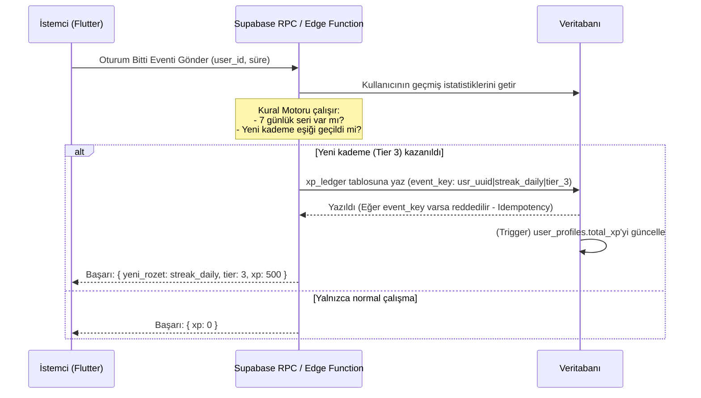

# Odak Kampı — Başarım 3.0 & XP Ledger Mimarisi

> **Durum:** Tasarım Aşamasında (Kullanıcıdan kademe girdileri bekleniyor)
> **İlgili Faz:** V8 sonrası (Faz 3)

## 1. Mimari Hedefler
Mevcut sistemde (v7) başarımların ilerlemesi ve XP (deneyim puanı) istemci tarafında hesaplanıp sunucuya gönderilmektedir. Bu durum, API'yi dinleyen veya uygulamanın kaynak kodunu değiştiren kötü niyetli kullanıcıların sahte XP ve başarım (rozet) basmasına olanak tanımaktadır.

**Başarım 3.0 (Server-Authoritative) Kuralları:**
1. **İstemci asla XP miktarını doğrudan veritabanına yazamaz.** Yalnızca bir olay (event) gönderir (örn: `oturum_tamamlandi`, `durtme_gonderildi`).
2. **Append-Only XP Ledger:** XP, kullanıcının mevcut puanının üzerine güncellenen tek bir sütun yerine, `xp_ledger` adlı sadece-eklenebilir (append-only) bir defter tablosuna kaydedilir. Toplam XP, bu defterdeki kayıtların toplanmasıyla hesaplanır (veya tetikleyici ile önbelleğe alınır).
3. **Idempotency (Tekrarlanmazlık):** Aynı başarımdan iki kez aynı seviye puanı alınmasını veya zayıf ağ koşullarında çift gönderimi engellemek için her ledger kaydının benzersiz (unique) bir `event_key` değeri olmalıdır.
4. **Sosyal Profil Güvenliği:** Bir kullanıcının seçtiği "Vitrin Rozetleri" ve XP'si, yalnızca aynı grupta (aktif) olan diğer üyelere gösterilir (RLS kuralları).

---

## 2. Veritabanı Şeması (Supabase PostgreSQL)

### 2.1. `achievements_dict` (Sözlük / Meta Tablosu)
Sistemdeki tüm başarımların ve kademelerinin statik olarak tutulduğu tablo.
- `id` (text, PK): Başarımın benzersiz kodu (ör. `streak_daily`)
- `category` (text): Çalışma, Seri, Grup, Sosyal, Gizli
- `name` (text): Kullanıcıya gösterilen isim
- `description` (text): Açıklama şablonu
- `max_tier` (int): Bu başarımın kaç kademesi olduğu
- `icon_url` (text): Vektör veya Lottie asset yolu

### 2.2. `xp_ledger` (Muhasebe / Kayıt Defteri - Append-Only)
Her kazanılan puanın veya rozet kademesinin değişmez kaydı.
- `id` (uuid, PK)
- `user_id` (uuid, FK)
- `achievement_id` (text, FK)
- `tier` (int): Ulaşılan kademe (1, 2, 3...)
- `xp_amount` (int): Kazanılan XP miktarı
- `reason` (text): İsteğe bağlı açıklama (ör. "7 gün üst üste çalışma")
- `event_key` (text, UNIQUE): Hileyi ve çift kaydı önleyen idempotency anahtarı. (Örnek: `user_uuid|streak_daily|tier_3`)
- `created_at` (timestamptz)

### 2.3. `user_profiles` (XP Önbelleği ve Vitrin)
Mevcut profil tablosunda tutulacak yeni eklentiler.
- `total_xp` (int): Ledger'dan hesaplanan güncel puan. İstemci yazamaz, Supabase Trigger (Tetikleyici) tarafından güncellenir.
- `showcase_badges` (text[]): Kullanıcının profilinde sergilemek üzere seçtiği maksimum 3 başarımın id'si.

---

## 3. Sistem Akışı (Server-Authoritative Flow)

---

## 4. Başarım Kategorileri ve Tasarım (Kullanıcı Girdisi Bekleniyor)

Bu başarımlar 5 kategoriye ayrılmıştır. Her birinin elde edilmesi giderek zorlaşan "Kademeleri (Tier)" olacaktır. Eşik değerleri ve kazanılacak XP'ler tasarım aşamasındadır.

### 🎯 Çalışma (Odak) Başarımları
- **Maratoncu (Kümülatif Toplam Süre):** Uygulama ömrü boyunca toplam çalışma saati.
  - Kademe 1: 50 saat (Ödül: 100 XP)
  - Kademe 2: 200 saat (Ödül: 500 XP)
  - Kademe 3: 500 saat (Ödül: 1500 XP)
  - Kademe 4: 1000 saat (Ödül: 5000 XP)
  - Kademe 5 (Efsanevi): 2500 saat (Ödül: 15000 XP)
- **Çelik İrade (Tek Oturum):** Mola vermeden tek seferde masada kalma süresi.
  - Kademe 1: 1 saat (Ödül: 50 XP)
  - Kademe 2: 1.5 saat (Ödül: 100 XP)
  - Kademe 3: 2 saat (Ödül: 250 XP)
  - Kademe 4: 3 saat (Ödül: 1000 XP)
  - Kademe 5 (Efsanevi): 5 saat (Ödül: 5000 XP)
- **Günün Kahramanı:** Tek bir takvim gününde çalışılan toplam süre.
  - Kademe 1: 2 saat (Ödül: 50 XP)
  - Kademe 2: 4 saat (Ödül: 150 XP)
  - Kademe 3: 6 saat (Ödül: 500 XP)
  - Kademe 4: 8 saat (Ödül: 1500 XP)
  - Kademe 5 (Efsanevi): 10 saat (Ödül: 5000 XP)

### 🔥 Seri ve Düzen Başarımları
- **Ateş Harlı (Kesintisiz Günlük Seri):** Arka arkaya her gün hedefe ulaşma serisi.
  - Kademe 1: 7 gün (Ödül: 100 XP)
  - Kademe 2: 30 gün (Ödül: 500 XP)
  - Kademe 3: 150 gün (Ödül: 2500 XP)
  - Kademe 4: 365 gün (Ödül: 10000 XP)
  - Kademe 5 (Efsanevi): 730 gün (Ödül: 30000 XP)
- **Hafta Sonu Savaşçısı:** Sadece Cumartesi-Pazar çalışarak hedefe ulaşılan gün sayısı.
  - Kademe 1: 4 gün (Ödül: 50 XP)
  - Kademe 2: 8 gün (Ödül: 150 XP)
  - Kademe 3: 20 gün (Ödül: 500 XP)
  - Kademe 4: 50 gün (Ödül: 1500 XP)
  - Kademe 5 (Efsanevi): 100 gün (Ödül: 5000 XP)
- **Kusursuz Ay:** Bir ay (30 gün) boyunca belirlenen hedefin altına hiç düşmeme sayısı.
  - Kademe 1: 1 ay (Ödül: 300 XP)
  - Kademe 2: 3 ay (Ödül: 1000 XP)
  - Kademe 3: 6 ay (Ödül: 2500 XP)
  - Kademe 4: 12 ay (Ödül: 7500 XP)
  - Kademe 5 (Efsanevi): 24 ay (Ödül: 20000 XP)

### 👥 Grup Başarımları
- **Alfa Kurt (Grup Birincisi):** Grupta gün birincisi olma sayısı.
  - Kademe 1: 5 kez (Ödül: 100 XP)
  - Kademe 2: 10 kez (Ödül: 300 XP)
  - Kademe 3: 20 kez (Ödül: 1000 XP)
  - Kademe 4: 50 kez (Ödül: 3000 XP)
  - Kademe 5 (Efsanevi): 100 kez (Ödül: 10000 XP)
- **Takım Oyuncusu:** Grubun günlük hedefini doldurmasına katkı sağlama sayısı.
  - Kademe 1: 10 kez (Ödül: 50 XP)
  - Kademe 2: 30 kez (Ödül: 200 XP)
  - Kademe 3: 100 kez (Ödül: 800 XP)
  - Kademe 4: 300 kez (Ödül: 2500 XP)
  - Kademe 5 (Efsanevi): 1000 kez (Ödül: 8000 XP)
- **Kamp Ateşi Etrafında:** Grupta aynı anda en az 3 kişi aktifken senin de masada kaldığın süre.
  - Kademe 1: 10 saat (Ödül: 100 XP)
  - Kademe 2: 50 saat (Ödül: 400 XP)
  - Kademe 3: 150 saat (Ödül: 1500 XP)
  - Kademe 4: 500 saat (Ödül: 5000 XP)
  - Kademe 5 (Efsanevi): 1000 saat (Ödül: 12000 XP)

### 💬 Sosyal Başarımlar
- **İlham Kaynağı:** Arkadaşlarına dürtme (nudge) gönderdiğinde onların uygulamaya girip çalışmaya başlama sayısı. *(Anti-spam: Günde en fazla 2 kişi sayılır).*
  - Kademe 1: 5 kez (Ödül: 100 XP)
  - Kademe 2: 20 kez (Ödül: 400 XP)
  - Kademe 3: 50 kez (Ödül: 1200 XP)
  - Kademe 4: 150 kez (Ödül: 4000 XP)
  - Kademe 5 (Efsanevi): 500 kez (Ödül: 15000 XP)
- **Lokomotif (Sürükleyici):** Grupta kimse çalışmıyorken (0 aktif) masaya ilk senin oturman ve ardından gelen 15 dakika içinde en az 2 grup üyesinin daha ilham alıp seninle beraber çalışmaya başlaması. 
  - Kademe 1: 5 kez (Ödül: 150 XP)
  - Kademe 2: 15 kez (Ödül: 500 XP)
  - Kademe 3: 30 kez (Ödül: 1500 XP)
  - Kademe 4: 100 kez (Ödül: 4500 XP)
  - Kademe 5 (Efsanevi): 300 kez (Ödül: 15000 XP)

### 🕵️ Gizli / Eğlenceli Başarımlar (Sürpriz Paskalya Yumurtaları - Tek Seferlik Ödüller)

**Görünüm Kuralları:** Bu başarımlar, kullanıcının profilindeki başarımlar listesinde kilitliyken `?????` (Soru işareti) veya siyah bir siluet olarak görünür. Şartlarının ne olduğu asla yazmaz ("Gizli bir başarım, açmak için şanslı veya çok dikkatli olmalısın" yazar). Kullanıcı tesadüfen bu şartı sağladığında ekranda efsanevi bir animasyonla rozet açılır!

- **Gece Kuşu:** Gece 00:00 ile 04:00 arası kesintisiz en az 2 saat odaklanıldığında kazanılır. (Ödül: 500 XP)
- **Gün Doğumu:** Sabah 05:00 - 07:00 arası kesintisiz en az 1 saat odaklanıldığında kazanılır. (Ödül: 500 XP)
- **404 Dakika:** Tesadüfen bir oturuşta tam olarak 404 dakika (6 saat 44 dk) çalışıldığında gizli olarak açılır. (Ödül: 4044 XP)
- **Pi Sırrı:** Bir oturuşta sayacı tam olarak 3 saat 14 dakikada (194 dakika) durdurduğunda açılır. (Ödül: 314 XP)
- **Mola Düşmanı:** Pomodoro modunda veya sayaçta üst üste 4 kez mola hakkını "Atla" diyerek mola vermeden doğrudan çalışmaya devam ettiğinde açılır. (Ödül: 1000 XP)
- **Son Saniye Kurtarıcısı:** Gece gün dönümüne (00:00'a) sadece saniyeler/dakikalar kalmışken, saat tam 23:55 ile 23:59 arasında günlük hedefini %100'e tamamladığında açılır. (Ödül: 1500 XP)
- **1337 Elite:** Öğleden sonra tam saat 13:37'de kronometreyi başlatıp o oturumu en az 1 saat hiç bozmadan sürdürdüğünde açılır. (Ödül: 1337 XP)
- **Sınır Tanımaz:** Kendine koyduğun günlük hedefi (örneğin 2 saat) doldurduktan sonra bile sayacı durdurmayıp, aynı gün içinde hedefin tam %300'üne (3 katına) ulaştığında açılır. (Ödül: 3000 XP)
- **Matrix Hatası (Asimetrik):** Kronometreyi tesadüfen tam olarak 111, 222, 333 veya 555. dakikasında (aynı rakamlardan oluşan bir dakikada) durdurduğunda verilir. (Ödül: 1111 XP)
- **Yılbaşı Nöbeti:** 31 Aralık gecesi saat 23:50 ile 1 Ocak saat 00:10 arasında uygulamada kronometresi açık şekilde yeni yıla masada giren efsanelere verilir. (Ödül: 5000 XP)
