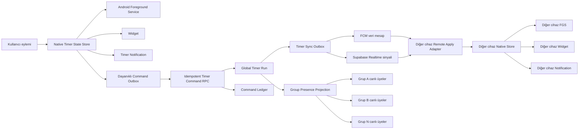

# Odak Kampı — Global Kronometre, Çoklu Grup Presence ve Çoklu Cihaz Senkronizasyonu

> Belge türü: Mimari RFC + ürün/tasarım kararı + uygulama ve doğrulama planı
>
> Durum: **V3 UYGULAMA PLANI — iki senior review işlendi; Delivery A/B onaylı, Delivery C migration öncesi compatibility gate zorunlu**
>
> Tarih: 2026-07-26
>
> Kapsam: Flutter uygulaması, Android foreground service, bildirim, ana ekran widget'ı, Supabase/PostgreSQL, Realtime, FCM, çoklu cihaz ve çoklu grup görünürlüğü
>
> Öncelik: Mevcut kronometre + bildirim + widget davranışı korunmadan bu tasarım devreye alınamaz.

---

### Revizyon 3 — ikinci senior review ve son repo doğrulaması

Bu sürüm uygulamaya geçiş sürümüdür. Yeni bir mimari yön aramaz; V2'nin legacy compatibility boşluklarını kapatır.

Kesin ek kararlar:

1. `live_study_runs.status` yeniden kullanılır; ikinci bir `state` kolonu eklenmez.
2. Legacy satırlar `protocol_version=1`, `run_kind='study'` olarak backfill edilir.
3. Tek aktif-study invariant'ı legacy ve V2'yi birlikte kapsar; partial unique index `protocol_version=2` ile daraltılmaz.
4. V1 status CHECK kümesi `running`, `paused`, `finalized`, `cancelled`, `stopped`, `abandoned` değerlerini kabul eder. V2 yalnız `running/stopped/abandoned` üretir.
5. V2 ve legacy start RPC'leri aynı kullanıcı advisory-lock alanını kullanır.
6. Start command `command_id`, run satırındaki zorunlu `client_request_id` alanına aynen yazılır.
7. Legacy `LiveStudyRun/LiveRunStatus` modeli donuktur. V2 snapshot ayrı DTO/RPC ile parse edilir.
8. Native `TimerExternalCommandStore.commandSeq` yerel tek-atımlık UI köprüsüdür; server command outbox sırası değildir.
9. Native `pendingIntervals` heterojen kuyruğu versionlanabilir; V2 kayıtları açık `kind/schema_version/command_id/account_id` discriminator'ı taşır ve legacy `runToken` formatını taklit etmez.
10. `live_study_segments` yararlı work-segment iskeletidir; phase türü/reason/preset taşımadığı için tam Pomodoro ledger'ı sayılmaz.
11. Canlı projection'daki `counts_for_group_progression` read-model alanıdır. Tarihsel day/week/achievement recompute otoritesi `study_session_group_attribution` ilişkisidir.
12. WP-329 bildirimleri primary gruba filtrelemez. Direct grup bildirimleri bütün ilgili üyeliklerde sürer; yalnız görev/hedef/grup progression muhasebesi primary gruba bağlanır.
13. Delivery C migration'ından önce mevcut `running/paused` legacy satır sayısı her hedef ortamda salt okunur ölçülür; index/CHECK/RPC/DTO compatibility raporu geçmeden SQL yazılmaz.

### Revizyon 2 — 2026-07-26 senior review sonucu

Bu sürüm ilk senior review raporundaki kodla doğrulanmış bulguları işler.

Bağlayıcı revizyon kararları:

1. `run_revision` yalnız bir run içindeki değişiklikleri sıralar; cihazlar arası hesap-geneli sıralama için ayrıca `user_state_version` kullanılır.
2. `recovery_required` açık run durumu değildir. Kurtarılamayan/lease'i düşen çalışma terminal `abandoned` olur ve yeni başlangıcı bloklamaz.
3. Command idempotency anahtarı global değil kullanıcı kapsamındadır: `unique(user_id, command_id)`.
4. İlk teslimatta pause/resume, countdown ve Pomodoro faz senkronu yoktur. V1 global protokol yalnız stopwatch start/stop ve güvenli remote stop'tur.
5. Mevcut `live_study_runs` ve ilişkili segment/session bağı yeni paralel bir run sistemi kurmadan önce additive olarak evrimleştirilecek birincil adaydır.
6. Native UUID interval idempotency, `ACTION_STOP_SILENT` ve mevcut native pending command kuyruğu yeniden yazılmayacak; donuk invariant olarak korunacaktır.
7. Mevcut genel push hattı timer sync için hazır kabul edilmez. Type allowlist, preference, quiet-hours, TTL, collapse ve origin-device exclusion ayrı kabul kapılarıdır.
8. Çoklu grup presence ilk bağımsız teslimattır. Global timer, server finalization ve gün sınırı değişikliği onun ön koşulu değildir.
9. Gün sınırı/time-zone muhasebesi ve server finalization bu RFC'den ayrılmış bağımlı programlardır; mevcut istatistik sözleşmeleri burada topluca değiştirilmez.
10. Presence bütün üyeliklerde görünür; grup progression ve sosyal achievement tetikleri yalnız `counts_for_group_progression=true` olan tek attribution grubunu sayar.
11. Projection her heartbeat'te yazılmaz. Kanonik lease tek kayıtta tutulur; projection state geçişlerinde ve lease expiry sweeper'ının tek seferlik kapatmasında değişir.
12. Kapalı uygulamadan widget/bildirim ile başlatmanın sunucuya anında çıkması, yalnız server-side fan-out veya FCM ile çözülemez. Güvenli native uplink ayrı bir capability ve güvenlik kararıdır.

Bu kararlar belgenin daha aşağıdaki eski bir ifadesiyle çelişirse bu revizyon listesi ve revize edilmiş veri/protokol bölümleri kazanır.

## 0. Yönetici özeti

Bugünkü senkronizasyon sorunu tek bir bug değildir.

Birbiriyle ilişkili üç mimari eksiklik vardır:

1. Presence tablosu kullanıcı başına yalnızca bir satır ve yalnızca bir `group_id` tutuyor.
2. Widget veya bildirim uygulama süreci kapalıyken native tarafta kronometreyi başlatabiliyor; fakat presence yayını Flutter süreci çalışmadan gerçekleşmiyor.
3. Kronometrenin hesabın bütün cihazlarında ortak kabul edilen, sunucu tarafında sürümlenmiş bir “global çalışma durumu” bulunmuyor.

Bu nedenle:

- Kullanıcı beş gruba üyeyse yalnızca seçili/aktif grupta çalışıyor görünebiliyor.
- Widget veya bildirimden başlatılan kronometre yerelde doğru çalışsa bile sosyal presence geç veya hiç oluşmayabiliyor.
- Telefonda başlayan kronometre tablet tarafından güvenilir biçimde bilinmiyor.
- İki cihaz eşzamanlı komut gönderdiğinde hangi durumun doğru olduğu tanımlı değil.
- Mevcut fire-and-forget presence yazımları hata veya auth yarışında sessizce kaybolabiliyor.

Önerilen çözüm “kronometrenin tamamını sunucuya taşımak” değildir.

Önerilen çözüm hibrit bir mimaridir:

- **Yerel native kronometre**, bildirim ve widget için anlık çalışma otoritesidir.
- **Sunucu global durumu**, hesaplar arası değil aynı hesabın cihazları arasındaki ortak doğruluk ve sosyal görünürlük otoritesidir.
- **FCM/Realtime**, doğruluğun kendisi değil, cihazları yeni sunucu sürümünden haberdar eden taşıma katmanıdır.
- **Presence**, istemcinin seçili gruba yazdığı veri olmaktan çıkar; global kullanıcı durumundan ve grup üyeliklerinden türetilen sunucu kontrollü bir read model olur.

En önemli prensip:

> Sunucu çalışmasa bile mevcut cihazdaki başlat/durdur, foreground service, bildirim ve widget çalışmaya devam etmelidir.

İkinci en önemli prensip:

> Bir cihazdaki yerel kullanıcı eylemi ağ cevabını beklememelidir; önce mevcut native akış çalışmalı, sunucu senkronizasyonu dayanıklı bir outbox üzerinden asenkron yapılmalıdır.

Üçüncü en önemli prensip:

> Bir çalışma oturumu kaç cihazda görüntülenirse görüntülensin yalnızca bir global çalışma ve yalnızca bir kanonik çalışma kaydı üretmelidir.

İki senior review ve repo doğrulaması tamamlanmıştır. Uygulama sırası, sahip sınırları ve
ölçülebilir kabul kriterleri `progress.md` içindeki WP-336–346 kartlarına bağlanmıştır.
İlk güvenli paralel dalga WP-328 + WP-337'dir; Delivery C migration'ı WP-337
compatibility gate geçmeden yazılmaz.

---

## 1. Sorunun ürün tanımı

### 1.1 Kullanıcının beklediği davranış

Kullanıcı bir kronometreyi:

- uygulama içinden,
- Android foreground service bildiriminden,
- Android ana ekran widget'ından,
- telefonundan,
- tabletinden,
- ileride desteklenirse başka bir masaüstü cihazdan

başlattığında sistem bunu aynı “global çalışma” olarak anlamalıdır.

Kullanıcı çalışmaya başladığında:

- üyesi olduğu bütün ilgili gruplarda aktif görünmelidir;
- diğer oturum açmış cihazları global durumu görmelidir;
- desteklenen foreground durumda diğer Android cihazın native timer/bildirim/widget yüzeyi
  aynı kanonik başlangıç zamanını göstermelidir; background/terminated durumda V1 garantisi
  timer-sync sinyali ve uygulama açılışında reconcile ile sınırlıdır;
- süre ekrana sıfırdan başlamamalı, kanonik `started_at` üzerinden hesaplanmalıdır;
- başka cihazdan durdurulduğunda global çalışma bitmelidir;
- aynı çalışma iki kez session/XP üretmemelidir.

### 1.2 Bugünkü gözlenen semptomlar

- Kullanıcı çalışıyor olsa da bazı gruplarda çevrimdışı görünüyor.
- Widget'tan başlatınca uygulama içi timer çalışıyor olsa bile sosyal presence oluşmayabiliyor.
- Bildirimden başlatınca uygulama süreci kapalıysa Flutter heartbeat devreye girmiyor.
- Daha nadir olarak uygulama içinden başlatmada auth veya grup provider hazır olmadan presence yayını no-op olabiliyor.
- Presence write hataları kullanıcıya ve gözlem sistemine yeterince taşınmıyor.
- Başka cihaz mevcut kronometrenin başladığını veya durduğunu bilmiyor.

### 1.3 Başarı tanımı

Çözüm tamamlandığında:

- Yerel kronometre UX'i bugünkü kadar hızlı ve güvenilir kalır.
- Kullanıcı bütün aktif grup üyeliklerinde doğru görünür.
- Tek hesapta tek aktif global çalışma invariant'ı vardır.
- Telefon ve tablet aynı global başlangıç zamanını gösterir.
- Her yetkili cihaz global çalışmayı durdurabilir.
- Duplicate, gecikmiş veya sırası bozuk mesaj eski durumu geri getiremez.
- Push ulaşmasa bile cihaz uygulama açıldığında sunucudan doğru durumu alır.
- Offline davranış açık ve test edilebilir kurallara bağlıdır.
- Sosyal presence veya ağ sorunu yerel timer'ı durduramaz.
- Bir global çalışma yalnızca bir çalışma kaydı ve bir XP sonucu üretir.

---

## 2. Bu RFC'nin sınırları

### 2.1 Kapsama dahil

- Çoklu grup presence.
- Aynı hesaptaki çoklu cihaz senkronizasyonu.
- Uygulama/widget/bildirim başlangıç kaynaklarının ortak protokolü.
- V1 için global stopwatch start/stop ve güvenli remote stop komutları.
- Android background/terminated koşulları.
- Supabase şeması, RPC'ler, RLS ve Realtime projection.
- FCM transport, retry, acknowledgement ve capability modeli.
- Offline ve eşzamanlı komut çatışmaları.
- Mevcut session/XP yolunun duplicate üretmemesini koruyan entegrasyon sınırı.
- UX durumları, cihaz yönetimi ve hata iletişimi.
- Telemetri, QA, canary, rollback ve production geçişi.

### 2.2 Kapsama dahil olmayan veya ayrı karar isteyen konular

- iOS native timer/background davranışı.
- Başka bir kullanıcının kronometresini uzaktan kontrol etmesi.
- Grup yöneticisinin üyelerin timer'ını zorla durdurması.
- Kullanıcının aynı anda iki bağımsız timer çalıştırması.
- Pause/resume global senkronu.
- Countdown ve Pomodoro fazlarının global senkronu.
- Uygulama kapalıyken başka cihazın otomatik olarak foreground service başlatması.
- Web tarayıcıda background timer garantisi.
- XP ekonomisinin yeniden tasarlanması.
- Server-authoritative session/XP finalizer'a geçiş.
- `study_sessions.day`, İstanbul gün sınırı ve bölgesel gün muhasebesinin yeniden tasarlanması.
- Mevcut bildirim/widget görsel tasarımının refactor edilmesi.
- Mevcut timer servisinin genel temizliği veya “daha güzel mimari” gerekçesiyle yeniden yazılması.

Bu konular aynı altyapıdan yararlanabilir; fakat ilk güvenli teslimata eklenmemelidir.

---

## 3. Mevcut sistem tespiti

### 3.1 Presence veri modeli

Mevcut `public.presence` tasarımı özetle:

- `user_id` primary key,
- tek `group_id`,
- `status`,
- `started_at`,
- `today_seconds`,
- `subject_id`,
- `updated_at`

tutuyor.

Bir kullanıcı için yalnızca bir satır mümkün olduğu için aynı kişinin bütün gruplarda eşzamanlı görünmesi veri modeli seviyesinde mümkün değildir.

Bu bir query veya UI bug'ı değildir.

Primary key ve veri sahipliği tasarımı ürün beklentisiyle çelişmektedir.

### 3.2 Aktif grup bağımlılığı

Flutter presence yayını mevcut aktif/seçili grup provider'ını okuyor.

Sonuç:

- Kullanıcının seçtiği grup değişince presence satırındaki `group_id` değişebiliyor.
- Kullanıcı diğer gruplarda aktif sayılamıyor.
- Provider auth/grup üyeliğinden önce çalışırsa yayın atlanabiliyor.
- Presence, kullanıcı çalışma gerçeğinden çok UI seçim durumuna bağlanmış oluyor.

Sosyal görünürlüğün aktif ekrandaki grup seçimine bağlı olması yanlış sahipliktir.

### 3.3 Widget ve bildirim başlangıç akışı

Android native akışının güçlü yanı şudur:

- Widget veya bildirim doğrudan foreground service'e komut verir.
- Native store çalışma durumunu yazar.
- Foreground notification başlatılır/güncellenir.
- Widget güncellenir.
- Flutter açıksa veya sonra açıldığında reconcile yapılır.

Bu sayede uygulama süreci kapalıyken bile timer çalışabilir.

Bu davranış yüksek değer taşır ve korunmalıdır.

Ancak sosyal presence yayını Flutter tarafında olduğu için süreç kapalıyken:

- native timer başlar,
- bildirim ve widget doğru çalışabilir,
- fakat Supabase presence yazımı gerçekleşmez.

Flutter daha sonra açılırsa reconcile presence'i düzeltebilir; hiç açılmazsa sosyal durum stale/offline kalabilir.

### 3.4 Heartbeat bağımlılığı

Mevcut presence heartbeat'i Flutter yaşam döngüsüne bağlıdır.

Bu şu anlama gelir:

- Flutter isolate çalışmıyorsa heartbeat yoktur.
- İşletim sistemi süreci öldürdüyse presence lease yenilenmez.
- Native foreground service çalışıyor olsa bile sosyal presence bayatlayabilir.

Kronometrenin native, presence'in Flutter-only olması iki ayrı gerçeklik üretmektedir.

### 3.5 Hata görünürlüğü

Presence yazımlarının bir kısmı fire-and-forget çalışıyor.

Bazı hata yolları yakalanıp sessizce geçiliyor veya yalnızca local retry/cache'e bırakılıyor.

Bu yaklaşım timer UX'ini ağdan izole etmek için anlaşılırdır; fakat:

- hangi başlangıç kaynağında kaç publish kaybolduğu bilinmez,
- auth hazır değilken oluşan no-op ölçülmez,
- kullanıcı “çalışıyorum ama görünmüyorum” dediğinde neden sınıflandırılamaz,
- retry kuyruğunun yaşı ve başarısı takip edilemez.

Fire-and-forget korunabilir; fire-and-observe zorunlu hale gelmelidir.

### 3.6 Eski server-authoritative altyapı

Repoda `live_study_runs` ve buna ilişkin:

- tek aktif run invariant'ı,
- advisory lock,
- idempotent request,
- segment/finalization

fikirlerini içeren önceki bir altyapı bulunmaktadır.

Ancak güncel timer akışı bunu bilinçli olarak devre dışı bırakmaktadır.

Bu nedenle:

- `_verifiedServerAvailable` benzeri bayrağı doğrudan açmak güvenli değildir.
- Eski tablonun bugünkü widget/bildirim sözleşmesiyle uyumlu olduğu varsayılamaz.
- XP/finalizer davranışıyla istenmeyen coupling olabilir.
- Önceki altyapı referans ve test fikri olarak değerlidir; otomatik çözüm değildir.

Öneri:

- advisory lock,
- partial unique constraint,
- idempotency key,
- server finalization

desenleri yeniden kullanılsın; eski sistem körlemesine canlandırılmasın.

### 3.7 Mevcut push altyapısı

Mevcut push altyapısının yararlı özellikleri vardır:

- Kullanıcı + installation kimliğiyle çoklu cihaz kaydı.
- Bir kullanıcıdaki bütün aktif cihazlara fan-out.
- Outbox/delivery ayrımı.
- FCM token yenileme ve cihaz kayıt akışı.
- Android high-priority data payload gönderme kabiliyeti.

Bu altyapı global timer için araştırılabilir bir temeldir; timer mesajını bugün taşıyabildiği anlamına gelmez.

Ancak timer sync mesajı:

- normal kullanıcı bildirimi değildir,
- quiet hours nedeniyle ertelenmemelidir,
- nudge cooldown kurallarına girmemelidir,
- kısa TTL ve state-version/collapse semantiği ister,
- teslim edildi diye uygulanmış kabul edilmemelidir.

Kodla doğrulanan allowlist, `_push_type_enabled`, quiet-hours, sabit TTL, collapse ve origin-exclusion engelleri giderilmeden mevcut transport “kullanılabilir” kabul edilmez.

### 3.8 Dokümantasyon tespiti

`docs/qa/DEVICE-QA-MATRIX.md` timer/widget/FGS alanını “DONUK” olarak işaretlemektedir.

Bu RFC o kuralı genişletir:

- timer refactor'ı yapılmamalı;
- yeni global sync ayrı adaptör ve feature flag ile eklenmeli;
- bug çıkarsa ayrı debug işi açılmalı;
- fiziksel cihaz kanıtı olmadan tamamlandı denmemeli.

`project.md` içindeki tarihsel “presence.group_id korunur” notu V3 legacy-fallback +
server-derived projection ayrımıyla güncellenmiştir. Bu RFC, `progress.md`, `project.md`,
`backlog.md` ve `docs/KALITE-PROGRAMI.md` aynı karar setine bağlanır.

### 3.9 Kod kanıt haritası

Senior incelemede başlangıç noktası olacak mevcut kod alanları:

| Konu | Mevcut kaynak | İncelenecek davranış |
|---|---|---|
| Yol haritası | `progress.md` WP-328/WP-329 | Keşif sırası, birincil grup, görev/hedef/başarım ve gün sınırı kararı |
| Presence şeması | `supabase/migrations/0001_initial_schema.sql` | `user_id` primary key ve tek `group_id` |
| Aktif grup seçimi | `app/lib/data/providers/group_providers.dart` | `userGroupProvider` seçili/ilk grubu döndürüyor |
| Timer publish | `app/lib/data/providers/study_providers.dart` | `_publishPresence`, auth/grup yoksa return, hata davranışı |
| Timer start | `app/lib/data/providers/study_providers.dart` | local state → native FGS → presence/tick/surface sırası |
| Cold-start reconcile | `app/lib/data/providers/study_providers.dart` | native state/pending interval/Flutter state uzlaştırma |
| Presence heartbeat | `app/lib/data/providers/presence_lifecycle.dart` | Flutter isolate ömrüne bağlı heartbeat |
| Presence stale/read | `app/lib/data/providers/presence_providers.dart` | heartbeat ve stale threshold, aktif grup filtresi |
| Supabase presence | `app/lib/data/repositories/supabase/supabase_presence_repository.dart` | table upsert ve `group_id` watch |
| Offline presence | `app/lib/data/repositories/offline/offline_first_presence_repository.dart` | cache/pending/retry ve gözlem eksikleri |
| Native timer service | `app/android/app/src/main/kotlin/com/manilmax/online_study_room/timer/StudyTimerService.kt` | action routing, store/notification/widget/Dart sırası |
| Native timer store | `app/android/app/src/main/kotlin/com/manilmax/online_study_room/timer/TimerStateStore.kt` | kalıcı state ve pending verified command alanı |
| Local notification background handler | `app/lib/core/notifications/timer_notification_service.dart` | native/local command'ın server command olmaması |
| Legacy global run | `supabase/migrations/0051_verified_live_sessions.sql` | advisory lock, idempotency, segment/finalization fikirleri |
| Mevcut group metric fan-out | `supabase/migrations/0063_equal_study_sources.sql` | Session sonrası bütün aktif üyelikleri dolaşan metric refresh |
| Push device/outbox | `supabase/migrations/0066_push_notification_delivery.sql` | installation başına cihaz ve per-device fan-out |
| Session day stamp | `supabase/migrations/0073_session_day_stamp.sql` | Mevcut sabit Europe/Istanbul günü; ayrı gün-sınırı programında değerlendirilecek |
| Grup IANA zone | `supabase/migrations/0076_group_time_zone.sql` | Ayrı gün-sınırı programının olası girdisi; V1 kararı değil |
| Push dispatcher | `supabase/functions/dispatch-push/index.ts` | data-only FCM, Android priority, TTL ve mevcut message types |

Bu harita planlama kanıtıdır; uygulama başında graph index ve gerçek kaynak tekrar okunmalıdır.

Aktif ajan değişiklikleri nedeniyle satır numaraları sabit kabul edilmemelidir.

### 3.10 Arşiv timer raporlarından devralınan riskler

Tarihsel timer mimarisi raporu repodan kaldırıldı; içeriği git geçmişindedir.

Raporda global sync tasarımının ayrıca koruması gereken dört önemli risk anlatılmıştır:

#### Durdurma anında çift sayım

Stop sırasında:

- kaydedilmiş toplam,
- henüz akan live süre,
- ağ gecikmesi arasındaki Flutter frame

aynı anda hesaba girerse UI geçici veya kalıcı biçimde tüm oturum kadar sıçrayabilir.

Global sync bu riski büyütebilir; çünkü stop RPC ve diğer cihaz ack gecikmesi yeni async pencereler ekler.

Önlem:

- UI'ın canlı süre hesabı server RPC beklememeli.
- Stop dokunuşunda yerel canlı katkı anında dondurulmalı.
- `isStopping`/terminal pending benzeri açık durum korunmalı.
- Global sync göstergesi toplam süre provider'ına ikinci bir live contribution eklememeli.
- Gerçek RTT ve `pump` içeren widget regresyon testi olmalı.

#### Pending interval kısmi başarı tekrarı

Native kuyrukta birden fazla interval varken ilk yazım başarılı, sonraki yazım başarısız olursa bütün kuyruğun yeniden gönderilmesi duplicate session üretebilir.

Global command idempotency tek başına bu eski interval kuyruğunu otomatik düzeltmez.

Kodda mevcut durum ve korunacak önlem:

- Her native interval zaten kalıcı UUID/source key taşır; bu invariant regresyon testiyle korunmalı.
- Session repository aynı source key'i idempotent işlemeli.
- Başarılı öğeler tek tek ack/silinmeli veya bütün batch server transaction'ında işlenmeli.
- Global `run_id` ile native interval ID arasındaki ilişki açık olmalı.
- Kısmi ağ başarısızlığı failure-injection testine girmeli.

#### Birden fazla “bugünkü toplam” hesabı

Farklı ekranların bugünkü toplamı farklı provider/formülle hesaplaması global timer geçişinde farklı süreler gösterebilir.

Önlem:

- Global run display contribution tek kanonik provider'dan gelmeli.
- Grup projection `today_seconds` ile kişisel UI toplamı aynı alan sanılmamalı.
- Personal stats, group stats ve live display'in muhasebe otoriteleri belgelenmeli.
- Geçişte dual-read değer farkı telemetry ile ölçülmeli.

#### Native pomodoro phase geçişi

Flutter isolate uyurken hedef süre dolarsa native notification'ın phase değiştirmemesi mümkündür.

Global mirror tasarımı bunu çözmüş varsayılmamalıdır.

Karar:

- Countdown/Pomodoro global mirror V1 kapsamı dışındadır.
- İleride preset snapshot ile append-only phase event/segment ledger birlikte tasarlanır.
- Manuel `start break/end break` eylemleri bulunduğu için faz yalnız ilk başlangıçtan türetilemez.
- Mutable server `phase` alanı tek otorite yapılmaz.

### 3.11 Arşiv bildirim audit'iyle uyum

Tarihsel bildirim audit'i de repodan kaldırıldı (git geçmişinde); zaten güncel worker talimatı değildi.

Bu RFC açısından kalıcı dersler:

- Realtime terminated uygulamayı uyandıran push değildir.
- FCM accepted sonucu cihazda uygulandı anlamına gelmez.
- Installation bazlı çoklu cihaz kaydı doğru temeldir.
- Push outbox ve per-device retry duplicate fan-out'u önlemelidir.
- Force-stop platform sınırıdır.
- OEM canlı yüzeyleri garanti edilemez.
- Timer state/service/action katmanı notification presentation değişikliklerinden ayrılmalıdır.

Arşivde dönemsel olarak standart/promoted notification önerileri ve daha sonra kullanıcı kabulüne göre değişen kararlar vardır.

Bu RFC:

- mevcut kabul edilmiş notification/widget sunumunu yeniden tartışmaya açmaz;
- “global sync yapıyoruz” gerekçesiyle custom/standard presentation arasında geçiş önermez;
- yalnızca mevcut yüzeylere ayrı remote-apply protokolü ekler.

Herhangi bir notification presentation değişikliği ayrı ürün kararı, ayrı WP ve ayrı fiziksel cihaz kabulü gerektirir.

---

## 4. Kök neden analizi

### 4.1 Kök neden A — yanlış cardinality

Mevcut model:

```text
user -> one presence row -> one group
```

Ürün beklentisi:

```text
user -> one live work state -> all active group memberships
```

Kullanıcı durumu kullanıcıya aittir; grup görünümü bu durumun üyeliklere dağıtılmış bir projeksiyonudur.

### 4.2 Kök neden B — yanlış süreç sahipliği

Timer native süreçte yaşayabiliyor.

Presence publisher ise Flutter sürecine bağımlı.

Bu yüzden native timer gerçeği ile sosyal durumun ömrü aynı değildir.

### 4.3 Kök neden C — global state machine eksikliği

Telefon ve tablet arasında paylaşılabilen:

- `run_id`,
- run revision + user state version,
- command idempotency,
- conflict policy,
- controller device,
- acknowledgement

yoksa “diğer cihazda da başlasın” güvenilir bir özellik olamaz.

### 4.4 Kök neden D — push'a aşırı anlam yükleme riski

FCM bir veritabanı değildir.

Mesaj:

- gecikebilir,
- yinelenebilir,
- sırası bozulabilir,
- cihaz tarafından alınmayabilir,
- high priority olsa bile işletim sistemi tarafından farklı ele alınabilir.

Dolayısıyla push payload “yeni gerçek” değil, “sunucuda yeni bir state version var; doğrula” sinyali olmalıdır.

### 4.5 Kök neden E — session ve görünüm katmanlarının karışma riski

Bir cihazdaki mirror timer'ın yerel stop yolu mevcut session kaydını tetiklerse:

- her cihaz aynı çalışma için session oluşturabilir,
- XP iki veya daha fazla kez yazılabilir,
- toplam süre şişebilir.

Global display ile session accounting kesin olarak ayrılmalıdır.

---

## 5. Mimari karar

### 5.1 Seçilen yaklaşım

**Hibrit local-first timer + server-authoritative global coordination + server-derived presence.**

Bu yaklaşımda üç ayrı otorite tanımlanır:

| Alan | Otorite | Neden |
|---|---|---|
| Yerel anlık ekran/bildirim/widget | Native local state | Ağdan bağımsız, hızlı ve mevcut güvenilir davranış |
| Aynı hesaptaki global run | Sunucu state machine | Çoklu cihaz çatışması, idempotency ve tek aktif run |
| Gruplarda aktif görünme | Sunucu read projection | Bütün üyeliklerde tutarlı visibility ve RLS |

### 5.2 Neden bütün timer sunucuya taşınmıyor?

Tam server-first yaklaşım:

- widget tıklamasını ağ gecikmesine bağlar,
- offline başlatmayı bozar,
- Android FGS başlangıcını network cevabına bağımlı kılar,
- mevcut dört günlük debug ile oturtulan native akışın risk alanını büyütür,
- kullanıcının dokunduğu anda geri bildirim alma beklentisini zayıflatır.

Sunucu her saniyeyi “tick” etmek zorunda değildir.

Sunucunun tutması gerekenler:

- başlangıç zamanı,
- durum,
- V1'de stopwatch modu,
- run içi `run_revision`,
- hesap-geneli `user_state_version`,
- bitiş zamanı,
- komut geçmişi ve idempotency.

Cihaz süreyi `now - started_at` ile hesaplar.

### 5.3 Neden sadece presence tablosunu çoğaltmıyoruz?

`presence` primary key'ini `(group_id, user_id)` yapmak hızlı bir ara çözüm olabilir.

Fakat tek başına:

- widget/notification Flutter kapalıyken publish sorununu çözmez,
- client'ın bütün üyeliklere fan-out yapmasına dayanır,
- üyelikten çıkış cleanup'ını zorlaştırır,
- çoklu cihaz çatışmasını çözmez,
- aynı kullanıcının cihazları arasında kanonik run sağlamaz,
- client spoof ve stale update riskini büyütür.

Bu nedenle yalnızca geçici patch olarak değerlendirilebilir; hedef mimari değildir.

### 5.4 Mevcut `live_study_runs` ile entegrasyon kararı

Yeni ve paralel bir `global_timer_runs` tablosu varsayılan karar değildir.

Mevcut `live_study_runs` şeması zaten şu yararlı invariant'ları taşır:

- kullanıcı kapsamlı request idempotency,
- başlangıç anı grup snapshot'ı,
- kullanıcı başına tek açık run,
- live segment bağı,
- `study_sessions.live_run_id` üzerinden tekil finalization bağı.

Bu nedenle tercih edilen yön:

1. Mevcut tablo ve bütün çağıran fonksiyonlar migration keşfinde envanterlenir.
2. Açık/eski satırlar ve kapalı feature yolu için compatibility testi yazılır.
3. V2 protokol alanları additive eklenir; örneğin `protocol_version`, `run_revision`, `user_state_version`, `controller_device_id`, `lease_expires_at`.
4. Yeni command RPC'si mevcut run kimliğini kullanır.
5. `study_sessions` içine ikinci bir `source_run_id` eklenmez; mevcut `live_run_id` bağı korunur.
6. Mevcut finalization kodu bu teslimatta açılmaz veya topluca değiştirilmez.
7. Mevcut `LiveStudyRun` DTO'su ve `LiveRunStatus.values.byName` parser'ı legacy RPC'lere ait kalır.
8. V2 `stopped/abandoned` snapshot'ı ayrı `GlobalTimerSnapshot` DTO'su ve ayrı RPC payload sürümüyle taşınır.

Ancak migration keşfi mevcut tablonun güvenli evrilemeyeceğini somut testlerle gösterirse yeni tabloya geçilebilir. Böyle bir karar ADR ister; iki paralel aktif-run kaynağına izin verilmez.

---

## 6. Hedef sistem genel görünümü



### 6.1 Kritik ayrım

Akışta iki farklı veri yolu vardır:

1. **Yerel hızlı yol**
   - Kullanıcı dokunur.
   - Native store yazılır.
   - Notification/widget güncellenir.
   - Ağ beklenmez.

2. **Global güvenilir yol**
   - Command local outbox'a yazılır.
   - RPC sunucuda idempotent uygulanır.
   - Yeni `user_state_version` ve gerekiyorsa `run_revision` oluşur.
   - Diğer cihazlar sinyal alır ve sunucu snapshot'ını doğrular.

Bu iki yol birleşir; fakat biri diğerinin başarısına bağımlı değildir.

---

## 7. Domain modeli

### 7.1 Temel kavramlar

#### Global run

Bir kullanıcının bütün cihazlarında ortak kabul edilen aktif veya tamamlanmış çalışma.

#### Command

Start, pause, resume, stop, heartbeat, takeover veya recovery gibi niyet.

#### Revision

Sunucunun kabul ettiği her state değişikliğinde monoton artan sürüm.

#### Controller device

Son kontrol komutunu kabul ettiren cihaz.

Bu cihaz tek yetkili cihaz değildir; açıklama, telemetry ve conflict çözümü için kullanılır.

#### Mirror device

Global run'ı yerel native yüzeylere yansıtan diğer cihaz.

Mirror cihaz gerektiğinde stop komutu gönderebilir; ancak global run için ikinci session yazamaz.

#### Presence projection

Global run'ın kullanıcı grup üyeliklerine dağıtılmış, RLS ile okunabilir sosyal görünümü.

#### Device acknowledgement

Bir cihazın belirli hesap-geneli state version'ı gördüğünü ve mümkünse native yüzeyine uyguladığını gösteren kayıt.

### 7.2 Önerilen state machine

V1 state machine bilinçli olarak küçüktür:

```text
idle -> running -> stopped
idle -> running -> abandoned
```

`stopped` kullanıcı veya güvenilir sistem stop'u ile biten terminal durumdur.

`abandoned` ise lease süresi dolmuş, sahibinden doğrulanamamış veya kurtarma politikasıyla terk edilmiş terminal durumdur. Açık-run unique constraint'ine girmez ve yeni start'ı bloklamaz.

Pause/resume V1'de yoktur.

Countdown/Pomodoro global faz senkronu V1'de yoktur. Mevcut native ürün manuel `start break` ve `end break` eylemleriyle faz epoch'unu değiştirdiği için Pomodoro durumunu yalnız ilk `started_at + preset + now` fonksiyonu olarak modellemek doğru değildir. İleride globalleştirilecekse:

- preset değişmez snapshot olur;
- manuel ve otomatik faz geçişleri append-only phase event/segment ledger'a yazılır;
- görüntülenen faz bu ledger ile server time'dan deterministik türetilir;
- yalnız cihaz yazdığı için bayatlayabilen mutable bir `phase` kolonu kanonik otorite yapılmaz.

Mevcut `live_study_segments` tablosu `(run_id, ordinal)` ve tek açık segment invariant'ıyla work interval ledger için iyi bir başlangıçtır. Ancak segment kind, transition reason, preset version ve work/short-break/long-break ayrımı taşımadığı için tek başına tam Pomodoro event ledger değildir. Ayrı program tabloyu evriltme ile ayrı event tablosu seçeneklerini gerçek payload ihtiyacına göre karşılaştırır.

### 7.3 Durum geçiş kuralları

| Mevcut | Komut | Sonuç |
|---|---|---|
| idle | start | Yeni run; `run_revision=1`, hesap `user_state_version` artar |
| running | aynı command_id start | Önceki sonuç dönülür |
| running | başka start | Var olan run adopt edilir veya conflict sonucu |
| running | stop | Run kapanır; her iki sürüm artar |
| stopped | aynı stop command_id | Önceki sonuç dönülür |
| stopped | gecikmiş eski start | Reddedilir |
| running run-rev 8 | expected run-rev 7 stop | Policy'ye göre reject veya güvenli stop |
| running | başka cihaz stop | Run kapanır; bütün cihazlar revizyonu alır |
| running, lease expired | sweeper | Run `abandoned` olur; yeni start serbest kalır |

Stop için özel değerlendirme:

- Kullanıcı güvenliği açısından stop çoğu zaman permissive olabilir.
- Fakat gecikmiş stop yeni bir run'ı kapatmamalıdır.
- Bu yüzden stop mutlaka `run_id` ile gönderilmeli; CAS `run_id + run_revision` üzerinde yapılmalıdır.
- Cihazlar “hangi snapshot daha yeni?” kararında `user_state_version` karşılaştırmalıdır.

---

## 8. Önerilen PostgreSQL veri modeli

Buradaki isimler mantıksal şemadır. Fiziksel isimler ilgili WP migration'ında mevcut ad
çakışmalarıyla doğrulanabilir; fakat V3 semantiği ve compatibility invariant'ları değişmez.

### 8.1 `live_study_runs` V2 evrimi

Bu ad bölüm başlığı olarak kavramsaldır; tercih edilen fiziksel tablo mevcut `live_study_runs`'dır. Yeni `global_timer_runs` ancak ayrı ADR ile seçilebilir.

Amaç:

- global çalışma gerçeğini tutmak,
- V2 `study` run'ı için kullanıcı başına tek aktif çalışma sağlamak,
- run içi CAS ile hesap-geneli snapshot sıralamasını ayırmak,
- mevcut `study_sessions.live_run_id` finalization bağını korumak.

Additive V2 alanları:

| Alan | Tür | Açıklama |
|---|---|---|
| `protocol_version` | integer | Legacy ve V2 davranışını ayırır |
| `run_kind` | text | V1 için `study`; gelecekteki türleri kilitlemez |
| `status` | text | Mevcut kolon yeniden kullanılır; V2: running, stopped, abandoned |
| `effective_started_at` | timestamptz | Stopwatch için kanonik başlangıç |
| `ended_at` | timestamptz nullable | Terminal zaman |
| `subject_id` | uuid nullable | Çalışma konusu |
| `accounting_group_id_snapshot` | uuid nullable | WP-329 hazırsa server'ın doğruladığı tek progression grubu |
| `origin` | text | app, widget, notification, recovery |
| `controller_device_id` | uuid nullable | Son kabul edilen kontrol cihazı |
| `run_revision` | bigint | Yalnız bu run içindeki monoton CAS sürümü |
| `user_state_version` | bigint | Kullanıcının bütün run'ları arasındaki monoton snapshot sürümü |
| `lease_expires_at` | timestamptz nullable | Kanonik liveness lease'i |
| `updated_at` | timestamptz | Server timestamp |

Mevcut tabloda eşdeğer alan varsa yeniden eklenmez; migration keşfi gerçek kolonu yeniden kullanır.

Constraint'ler:

- `run_revision >= 1`, `user_state_version >= 1`.
- `ended_at` yalnız terminal state'te doludur.
- Client `user_id`, accounting snapshot veya sürüm seçemez.
- Aşırı gelecekte/geçmişte başlangıç server validasyonuna tabidir.
- `abandoned` terminaldir; açık run sayılmaz.
- `protocol_version` legacy satırlarda `1`, V2 satırlarda `2` olur.
- `run_kind` mevcut ve V2 study satırlarında `study` olur.
- Mevcut `client_request_id not null` korunur; start command'ın `command_id` değeri buraya yazılır.
- Mevcut `finalized` ancak `finalized_at + session_id` ile geçerli kalır. V2 bu RFC'de `finalized` üretmez.
- Legacy `paused/finalized/cancelled` değerleri okunmaya devam eder; V2 pause üretmez.
- Tek aktif-study invariant'ı protocol version'dan bağımsızdır.

Kavramsal birleşik partial unique index:

```sql
create unique index one_open_study_run_per_user
on public.live_study_runs(user_id)
where run_kind = 'study'
  and status in ('running', 'paused');
```

Migration aynı transaction'da eski `live_study_runs_one_active_user` index'ini kaldırıp bu tek birleşik index'i kurar. İki active-run unique index'i yan yana bırakılmaz.

Migration öncesi zorunlu salt-okunur kanıt:

```sql
select status, count(*)
from public.live_study_runs
where status in ('running', 'paused')
group by status;
```

Sonuç local/staging/production için ortam kimliğiyle kaydedilir. Açık legacy satır varsa otomatik terminale çevrilmez; sahiplik ve recovery politikasıyla sınıflandırılır.

Mevcut status CHECK ikinci bir `state` kolonu eklenmeden genişletilir:

```text
running, paused, finalized, cancelled, stopped, abandoned
```

Legacy ve V2 start RPC'leri aynı advisory-lock anahtarını kullanır. Böylece birleşik unique index son savunma, lock deterministik conflict kaynağı olur.

#### Hesap-geneli sürüm kaynağı

`user_state_version` run sequence'ından türetilmez. Kullanıcı başına tek satırlı private bir state head tutulur:

```text
user_timer_state(
  user_id primary key,
  state_version bigint not null,
  current_run_id uuid null,
  updated_at timestamptz not null
)
```

Command RPC bu satırı kullanıcı lock'u altında `for update` alır ve kabul edilen her state değişikliğinde bir artırır. Sequence boşlukları tek başına monoton karşılaştırmayı bozmaz; buna rağmen transactional user head snapshot üretimini, current-run bağını ve test edilebilirliği sadeleştirir.

### 8.2 `global_timer_commands`

Amaç:

- idempotency,
- audit,
- latency ölçümü,
- duplicate/out-of-order analizi,
- retry sonucunu güvenilir döndürme.

Önerilen alanlar:

| Alan | Tür | Açıklama |
|---|---|---|
| `id` | uuid PK | Sunucu command kaydı |
| `command_id` | uuid | İstemcinin kullanıcı kapsamlı kalıcı idempotency anahtarı |
| `user_id` | uuid | Auth sahibi |
| `device_id` | uuid | Komutu oluşturan installation |
| `run_id` | uuid nullable | Hedef veya oluşturulan run |
| `action` | text | V1: start, stop, heartbeat, recover |
| `expected_run_revision` | bigint nullable | Hedef run için istemcinin bildiği CAS sürümü |
| `accepted_run_revision` | bigint nullable | Uygulama sonrası run sürümü |
| `accepted_state_version` | bigint nullable | Uygulama sonrası hesap-geneli sürüm |
| `client_occurred_at` | timestamptz | Yerel eylem zamanı |
| `server_received_at` | timestamptz | Güvenilir sıralama zamanı |
| `payload` | jsonb | Validasyonu yapılmış ayrıntılar |
| `result_code` | text | applied, duplicate, conflict, stale, rejected |
| `result_snapshot` | jsonb | Retry'da aynı cevap |
| `created_at` | timestamptz | Audit |

Kurallar:

- `command_id` cihaz retry'larında değişmez.
- Unique constraint `unique(user_id, command_id)` olur; global `unique(command_id)` kullanılmaz.
- Duplicate lookup her zaman önce `auth.uid()` ile kullanıcı kapsamına alınır; başka hesaba ait `result_snapshot` hiçbir koşulda dönmez.
- Aynı `command_id` farklı payload ile gelirse security/bug hatasıdır.
- İstemci tabloya doğrudan insert yapmaz; RPC üzerinden gider.
- `user_id` her zaman `auth.uid()` üzerinden alınır.
- `device_id` kullanıcının aktif installation kaydı olmalıdır.

### 8.3 `global_timer_device_state`

Amaç:

- cihaz capability'lerini,
- son görülen state version'ı,
- remote apply sonucunu,
- protocol compatibility'yi

tutmak.

Önerilen alanlar:

| Alan | Tür | Açıklama |
|---|---|---|
| `user_id` | uuid | Hesap |
| `device_id` | uuid | Installation |
| `protocol_version` | integer | Timer sync protokolü |
| `capabilities` | jsonb | remote_start, remote_stop, widget, FGS vb. |
| `auto_mirror_enabled` | boolean | Bu cihaz otomatik native aynalasın mı |
| `last_seen_state_version` | bigint | Hesap-geneli son görülen snapshot |
| `last_applied_state_version` | bigint | Native store'a uygulanan hesap-geneli snapshot |
| `last_run_id` | uuid nullable | Son uygulanan run |
| `last_run_revision` | bigint nullable | O run içindeki son CAS sürümü |
| `last_apply_status` | text | applied, deferred, denied, failed |
| `last_apply_error_code` | text nullable | Sınıflandırılmış hata |
| `last_seen_at` | timestamptz | Cihaz sağlığı |
| `updated_at` | timestamptz | Audit |

Primary key:

```text
(user_id, device_id)
```

### 8.4 `group_live_presence_projection`

Amaç:

- bir global kullanıcı durumunu bütün aktif grup üyeliklerinde görünür kılmak,
- Supabase Realtime için basit filtrelenebilir satırlar üretmek,
- sosyal ekrandaki sorgu modelini global run tablosundan ayırmak.

Önerilen alanlar:

| Alan | Tür | Açıklama |
|---|---|---|
| `group_id` | uuid | Göründüğü grup |
| `user_id` | uuid | Çalışan kullanıcı |
| `run_id` | uuid | Kaynak global run |
| `run_revision` | bigint | Projection sürümü |
| `user_state_version` | bigint | Hesap-geneli sıralama sürümü |
| `status` | text | working, offline |
| `started_at` | timestamptz nullable | Sosyal timer başlangıcı |
| `subject_id` | uuid nullable | Paylaşılabilir konu |
| `finalized_today_seconds_base` | integer | Son tamamlanmış projection tabanı; canlı süre buna cihazda eklenir |
| `counts_for_group_progression` | boolean | Yalnız tek attribution/primary grup için true |
| `updated_at` | timestamptz | Realtime güncelleme zamanı |

Primary key:

```text
(group_id, user_id)
```

Önemli:

- Projection'a client doğrudan yazamaz.
- Projection RPC/trigger transaction'ı içinde güncellenir.
- Üyelik eklenince aktif run varsa yeni projection oluşur.
- Üyelik bitince projection silinir veya erişilemez hale gelir.
- Run stop olunca bütün grup satırları aynı state version ile offline/stopped olur.
- Kullanıcının UI'da seçtiği grup bu modele etki etmez.
- Heartbeat her grup satırını güncellemez.
- Kanonik lease yalnız run/state head üzerinde yenilenir.
- Lease expiry sweeper run'ı bir kez `abandoned`, projection'ları bir kez `offline` yapar.
- İstemci canlı toplamı `finalized_today_seconds_base + max(0, server_now - started_at)` biçiminde türetir; gün sınırı yeniden tasarımı ayrı programdır.
- Sosyal görünürlük bütün aktif üyeliklere fan-out edilir.
- Canlı grup hedefi/read-model hesapları yalnız `counts_for_group_progression=true` satırlarını katılımcı/katkı olarak sayar.
- Tarihsel `locomotive/campfire/alpha` recompute bu projection alanını otorite kabul etmez; session attribution ilişkisine join eder.

### 8.5 Projection mı RPC join mi?

Alternatif:

- Grup üyeliklerini global run'a query sırasında join etmek.

Avantaj:

- Duplicate projection verisi yok.

Dezavantaj:

- Realtime filtreleme ve RLS daha karmaşık olabilir.
- Her grup ekranında join/RPC subscription modeli gerekir.
- Mevcut client watch akışı daha çok değişir.

Öneri:

- Canlı sosyal görünüm için projection.
- Kanonik gerçek için V2 alanlarıyla evriltilmiş `live_study_runs`.
- Projection her zaman yeniden üretilebilir olmalı.

### 8.6 `timer_sync_outbox`

Mevcut genel push outbox ve `dispatch-push` kodu timer sync taşımaya hazır değildir.

Kodla doğrulanan mevcut engeller:

- notification type CHECK/allowlist timer type'ını kabul etmez;
- `_push_type_enabled` bilinmeyen tipte `false` döndürür ve delivery satırı dahi üretmeyebilir;
- quiet-hours yalnız `self_test` için bypass edilir;
- normal TTL sabit ve timer state için fazlasıyla uzundur;
- collapse key yoktur;
- origin `exclude_device_id` yoktur;
- Flutter/Dart background handler bildirimi gösterir; native timer state'i güvenilir biçimde uygulayan özel bir Kotlin `FirebaseMessagingService` yoktur.

Dolayısıyla “mevcut parçaları kullanırız” bir tasarım kararı değil, ancak bütün aşağıdaki kapılardan sonra verilebilecek implementasyon sonucudur.

Önerilen alanlar:

- `user_id`
- `run_id`
- `user_state_version`
- `event_type`
- `exclude_device_id`
- `not_before`
- `expires_at`
- `collapse_key`
- `payload_version`
- delivery status

Timer sync:

- quiet hours'a takılmaz,
- reklam/hatırlatma cooldown'una takılmaz,
- çok kısa TTL kullanır,
- eski state version yeni state version tarafından collapse edilebilir,
- cihaz sunucu snapshot'ını fetch etmeden uygulanmış sayılmaz.

Tercih:

- V1'de mevcut outbox additive olarak genişletilebilir; fakat timer delivery sınıfı ayrı handler/policy ile çalışır.
- Bu değişiklik genel notification davranışını etkileyecek kadar dallanırsa ayrı `timer_sync_outbox` daha güvenlidir.
- Her iki durumda da unknown type sessiz no-op değil gözlemlenebilir konfigürasyon hatasıdır.
- FCM yalnız server-to-device sinyalidir; widget/bildirimden başlayan yerel native timer'ı server'a uplink etmez.

### 8.7 `user_group_preferences` ve birincil grup

WP-329 ile global timer aynı “birincil grup” kavramını kullanmalıdır.

Birincil grup:

- UI'da açık olan grup değildir;
- cihazdaki `active_group_id` değildir;
- kullanıcı hesabının sunucuda saklanan ortak tercihidir;
- telefon ve tablette aynı olmalıdır;
- yalnız aktif üye olunan bir grubu gösterebilir.

Önerilen private ilişki:

| Alan | Tür | Açıklama |
|---|---|---|
| `user_id` | uuid PK | Tercih sahibi |
| `primary_group_id` | uuid nullable | Görev/hedef/grup başarımı muhasebe grubu |
| `selected_at` | timestamptz | Seçim zamanı |
| `selection_revision` | bigint | Çoklu cihazda stale tercih yazımını önler |
| `updated_at` | timestamptz | Audit |

Bu ilişki `profiles` içinde de tutulabilir; ancak public profil görünürlüğü varsa private preference tablosu veri minimizasyonu açısından daha temizdir.

Mutation yalnız `set_primary_group` benzeri security-definer RPC üzerinden yapılmalıdır.

RPC:

1. `auth.uid()` doğrular.
2. Hedef grubun aktif üyeliğini doğrular.
3. Kullanıcı bazlı lock ile eşzamanlı cihaz seçimlerini sıralar.
4. Seçim revision'ını artırır.
5. Aktif global run varsa onun snapshot'ını değiştirmez.
6. Yeni seçimin yalnız sonraki run/session için geçerli olduğunu döndürür.

Hiç grup kalmadığında değer `null` olabilir.

Tek grup kaldığında otomatik atama yapılabilir.

Birden fazla grup kaldığında rastgele seçim yapılmamalı; kullanıcıdan açık seçim istenmelidir.

Birincil grup üyeliği bitince:

- preference temizlenir veya güvenli seçim durumuna geçirilir;
- geçmiş session/run snapshot'ları korunur;
- devam eden run için üyelik bitiş anında katkı kesme politikası uygulanır;
- kişisel timer ve kişisel ilerleme çalışmaya devam eder.

Offline start'ın “başladığı anda hangi grup primary idi?” sorusunu güvenilir cevaplamak gerekiyorsa yalnız güncel preference yeterli değildir.

Önerilen append-only history:

| Alan | Açıklama |
|---|---|
| `user_id` | Tercih sahibi |
| `primary_group_id` | O aralıkta etkin grup veya null |
| `valid_from` | Server effective başlangıç |
| `valid_to` | Sonraki seçimde kapanır |
| `selection_revision` | Sıralama/audit |
| `reason` | user_selected, only_group, membership_ended, group_deleted |

Server offline start'ı kabul ederken validasyonu yapılmış `client_occurred_at` anına denk gelen preference history satırını kullanabilir.

History tutulmayacaksa daha basit fakat daha az kesin politika açıkça yazılmalıdır:

> Offline start reconnect anındaki güncel primary gruba atfedilir.

Bu ikinci davranış kullanıcının offline başlangıç ile reconnect arasında primary değiştirdiği durumda şaşırtıcı olabilir.

### 8.8 Session attribution ilişkisi

WP-329 ile grup başarımlarını tek gruba bağlamak için yalnız run snapshot'ı yetmez; fakat `study_sessions` tablosuna doğrudan tekrar bir `group_id` eklemek de geçmişte kaldırılmış sahiplik modelini geri getirebilir.

Tercih edilen additive ilişki:

```text
study_session_group_attribution(
  session_id uuid primary key,
  group_id_snapshot uuid null,
  source_version integer not null,
  created_at timestamptz not null
)
```

Kurallar:

- Session kullanıcıya aittir; grup muhasebesi ayrı bir one-to-zero/one attribution kaydıdır.
- Aynı session en fazla bir grubun progression'ına girer.
- `group_id_snapshot` client tarafından seçilemez; server aktif primary üyelik ve başlangıç politikasıyla çözer.
- Primary değişimi geçmiş attribution'ı taşımaz.
- Grup silinmesi tarihsel audit'i bozmayacak tombstone/nullable FK kararı ister.
- Global run session bağı için ikinci `source_run_id` eklenmez; mevcut `study_sessions.live_run_id` kullanılır.
- Manual, Flutter timer ve native pending interval gibi bütün session kaynaklarının aynı attribution çözümüne girmesi WP-329'un ayrı migration/acceptance yüzeyidir.

Projection fonksiyonları için kritik kural:

- Attribution filtresi yalnız insert trigger'ında değil `project_group_day`, `project_group_week` ve eşdeğer catch-up/cron recompute sorgularının içinde uygulanır.
- `0063_equal_study_sources.sql` içindeki `raw -> seg -> thr/points/camp/totals/alpha/loco` zinciri yalnız hedef gruba attribution edilmiş session'larla kurulur.
- `group_achievement_daily` için `alpha_wins`, `campfire_seconds`, `locomotive_events`; `group_achievement_weekly` için `total_seconds`, `weekly_alpha_wins` aynı attribution kuralını kullanır.
- Gece/cron yeniden hesaplamasının secondary gruplara veri geri yazmadığı pgTAP/integration test ile kanıtlanır.

`day_time_zone_snapshot`, gün bölme ve mevcut `study_sessions.day` semantiğini değiştirmek bu RFC'nin V1 kapsamından çıkarılmıştır. Bunlar kanonik stats sözleşmesi ve bütün projection zinciriyle birlikte ayrı gün-sınırı programında ele alınır.

---

## 9. RLS ve güvenlik modeli

### 9.1 Temel ilke

Client, sosyal presence veya başka cihazların durumu üzerinde doğrudan yazma yetkisine sahip olmamalıdır.

Client yalnızca:

- kendi hesabı adına command RPC çağırır,
- kendi cihaz acknowledgement'ını günceller,
- yetkili olduğu grup projection satırlarını okur.

### 9.2 V2 `live_study_runs` politikası

Öneri:

- Kullanıcı yalnızca kendi run snapshot'ını select edebilir.
- Doğrudan insert/update/delete revoke edilir.
- Mutation yalnızca `security definer` RPC üzerinden yapılır.
- RPC içinde `auth.uid()` zorunlu.
- `search_path` sabitlenir.
- Tüm input'lar server-side validate edilir.

### 9.3 `global_timer_commands` politikası

- Kullanıcı yalnızca kendi command sonuçlarını sınırlı süre veya gerekli alanlarla görebilir.
- Ham payload içinde hassas cihaz bilgisi tutulmamalı.
- Doğrudan DML kapalı.
- Audit retention süresi belirlenmeli.

### 9.4 Presence projection politikası

Bir kullanıcı bir projection satırını yalnızca:

- kendisi o grubun aktif üyesiyse,
- hedef kullanıcı da o grubun aktif üyesiyse,
- grup erişim politikası görünürlüğe izin veriyorsa

okuyabilmelidir.

Eski/davet bekleyen/ayrılmış üyelikler erişim vermemelidir.

### 9.5 Cihaz kimliği

FCM token cihaz kimliği değildir.

Öneri:

- Mevcut installation kimliği kullanılsın.
- Token rotate olabilsin.
- Kullanıcı ayarlardan cihazı revoke edebilsin.
- Logout'ta cihaz kaydı deaktive edilsin.
- Bir cihaz başka kullanıcının command'ını ack edemesin.

### 9.6 Native auth riski

Uygulama süreci kapalıyken native servis sunucuya doğrudan RPC çağıracaksa auth token yönetimi kritik hale gelir.

Riskler:

- Refresh token'ın native shared preferences içinde uygunsuz tutulması.
- Token süresinin bitmesi.
- Çoklu hesap/logout sonrası yanlış hesaba command gitmesi.
- Service-role veya uzun ömürlü güçlü secret'ın cihaza konması.

Kesin yasak:

- `service_role` client/native katmana konmaz.
- Uzun ömürlü backend secret APK içine gömülmez.

Tercih edilen ilk sürüm:

- Native eylem önce dayanıklı local command outbox'a yazılır.
- Flutter/auth runtime hazır olduğunda outbox RPC'ye gönderilir.
- Arka planda hızlı sync gerekiyorsa güvenli, device-bound kısa ömürlü credential tasarımı ayrı security review alır.

Alternatif ileri sürüm:

- Backend'in imzaladığı, sınırlı scope'lu device credential.
- Android Keystore ile saklama.
- Kısa expiration, revoke, nonce ve installation binding.

Bu alternatif threat model ve rotation prosedürü olmadan uygulanmamalıdır.

### 9.7 Payload güvenliği

FCM payload:

- run detayının nihai otoritesi değildir,
- hassas profil veya token taşımaz,
- yalnızca `event_type`, `run_id`, `state_version`, `payload_version` gibi minimum işaret içerir,
- cihaz snapshot'ı auth ile sunucudan doğrular.

### 9.8 Abuse ve rate limit

RPC'ler için:

- kullanıcı/cihaz bazlı makul rate limit,
- heartbeat için ayrı limit,
- invalid command telemetry,
- command payload boyut limiti,
- maksimum aktif run süresi,
- clock skew limiti

tanımlanmalıdır.

### 9.9 Birincil grup tercih güvenliği

- Kullanıcı yalnız kendi primary preference'ını okuyup RPC ile değiştirebilir.
- Hedef grup için `group_members.user_id = auth.uid()` ve aktif üyelik zorunludur.
- Client session attribution ilişkisine veya run accounting snapshot'ına doğrudan yazamaz.
- Membership leave/delete ile primary seçimi aynı kullanıcı lock/transaction sınırında uzlaştırılmalıdır.
- Public profile sorguları primary preference veya preference history'yi gereksiz yere ifşa etmemelidir.
- Admin/service işlemleri audit reason taşımadan kullanıcı primary tercihini değiştirmemelidir.
- Birincil grup RLS yetkisini genişletmez; yalnız muhasebe seçimi sağlar.

---

## 10. RPC ve transaction tasarımı

### 10.1 `apply_global_timer_command`

Tek mutasyon giriş noktası önerilir.

Girdiler:

- `p_command_id`
- `p_device_id`
- `p_action`
- `p_run_id`
- `p_expected_run_revision`
- `p_client_occurred_at`
- `p_payload`
- `p_protocol_version`

Sunucu sırası:

1. `auth.uid()` doğrula.
2. Device registration ve revoke durumunu doğrula.
3. Command idempotency kaydını yalnız `(auth.uid(), command_id)` kapsamında kontrol et.
4. Aynı command ID farklı payload ise reddet ve audit et.
5. Kullanıcıya özel advisory transaction lock al.
6. `user_timer_state` head satırını `for update` oku/oluştur.
7. Mevcut açık V2 study run'ını `for update` oku.
8. Action/state/run/run-revision uyumunu doğrula.
9. Clock skew ve V1 stopwatch payload'ını doğrula.
10. Yeni start ise WP-329 hazır olduğunda server-side primary group snapshot'ını çöz.
11. Run'ı oluştur veya değiştir; `run_revision` artır.
12. `user_state_version` artır ve current run bağını güncelle.
13. Command sonucunu hem kabul edilen run revision hem state version ile yaz.
14. Bütün aktif grup üyelikleri için presence projection'ı yalnız state geçişinde güncelle.
15. Yalnız accounting group projection'ında `counts_for_group_progression=true` yap.
16. Origin cihaz hariç timer sync sinyali üret.
17. Atomik transaction'ı commit et.
18. Güncel server snapshot ve result code dön.

### 10.2 Neden kullanıcı bazlı advisory lock?

Aynı anda:

- telefon start,
- tablet start,
- gecikmiş widget retry

gelebilir.

Partial unique index son savunmadır.

Advisory lock ise:

- deterministik conflict sonucu,
- temiz command ledger,
- daha anlaşılır telemetry

sağlar.

### 10.3 Start semantiği

Sunucuda açık run yoksa:

- yeni run oluştur.

Açık run aynı run/command ise:

- idempotent sonucu dön.

Açık run başka cihazdan zaten başlamışsa önerilen ilk davranış:

- yeni run oluşturma;
- var olan run snapshot'ını `adopt_existing` olarak dön;
- yerel client gerekirse kendi local offline interval'ını conflict akışına taşır.

Bu adopt yalnız `state=running` ve kanonik lease geçerliyse yapılır.

Lease'i düşmüş run transaction içinde `abandoned` yapılır; ardından yeni start kabul edilir. Kullanıcıya 9 saatlik ghost run adopt ettirilmez.

### 10.4 Stop semantiği

Stop:

- mutlaka `run_id` hedeflemeli;
- yeni bir run'ı gecikmiş eski stop ile kapatmamalı;
- aynı run zaten durmuşsa idempotent `already_stopped` dönmeli;
- V1'de mevcut session finalization yoluna ikinci kez yazmamalı;
- ayrı server-finalization programı açılana kadar yalnız global state'i kapatmalıdır.

### 10.5 Heartbeat semantiği

Heartbeat:

- `run_revision` veya `user_state_version` değerini her seferinde artırmamalı;
- sadece lease ve device health yenilemeli;
- grup projection satırlarına fan-out yazmamalı;
- server time kullanmalı.

Örnek ilk değerler:

- heartbeat: 60 saniye,
- lease: 120–180 saniye.

Bunlar ürün sabiti değildir.

Pil, OEM ve ağ testleriyle ayarlanmalıdır.

### 10.6 Snapshot RPC

`get_global_timer_snapshot` şu veriyi tek cevapta döndürmelidir:

- aktif run veya idle,
- `user_state_version`,
- aktifse `run_id` ve `run_revision`,
- server time,
- V1 stopwatch başlangıcı,
- cihazın last seen/applied state version'ı,
- gerekiyorsa conflict/recovery sonucu.

Bu RPC:

- uygulama açılışında,
- FCM sinyalinde,
- Realtime reconnect'te,
- foreground dönüşünde,
- command conflict'inde

kullanılır.

### 10.7 Device acknowledgement RPC

Ack türleri:

- `seen`: server state version görüldü.
- `native_applied`: snapshot native timer store'a uygulandı.
- `deferred`: işletim sistemi nedeniyle hemen uygulanamadı.
- `failed`: sınıflandırılmış kalıcı/geçici hata.
- `opted_out`: kullanıcı bu cihazda native auto-mirror istemiyor.

Ack, global truth'ü değiştirmez.

---

## 11. Yerel Android sözleşmesi — korunacak alan

### 11.1 Donuk invariant

Mevcut yerel başlangıçta mantıksal sıra korunmalıdır:

1. Timer state store'a running durumu yazılır.
2. Foreground service başlatılır/foreground'a alınır.
3. Timer notification güncellenir.
4. Widget'lar güncellenir.
5. Flutter/Dart reconcile sinyali gönderilir.
6. Global command asenkron kuyruğa alınır/gönderilir.

Global sync:

- 1–4 arasına blocking network koyamaz.
- Mevcut notification ID/channel/PendingIntent sözleşmesini değiştiremez.
- Widget kaynaklarını ilk fazlarda yeniden tasarlayamaz.
- Başlangıç epoch hesaplamasını değiştiremez.
- Kullanıcı tıklamasına verilen anlık yanıtı geciktiremez.

Kodda zaten bulunan ve yeniden inşa edilmeyecek parçalar:

- native interval için UUID idempotency anahtarı (`appendPendingInterval`);
- ikinci session üretmeden yerel yüzeyleri kapatan `ACTION_STOP_SILENT`;
- sıralı native pending verified command kaydı (`appendPendingVerifiedCommand` + `commandSeq`).

Yeni global outbox bu mevcut kuyruğun formatını version ederek genişletmeli veya kontrollü migration ile onun yerini almalıdır. Aynı intent için Flutter outbox + eski native queue + yeni üçüncü native queue oluşturulmaz.

### 11.2 Remote apply için ayrı eylemler

Diğer cihazdan gelen durumu mevcut kullanıcı butonuna “sanal tıklama” olarak uygulamak tehlikelidir.

Yeni ve açık native komutlar önerilir:

- `REMOTE_APPLY_START`
- `REMOTE_APPLY_STOP`
- `REMOTE_RECONCILE_SNAPSHOT`

Bu eylemler:

- `run_id`,
- `user_state_version`,
- `run_revision`,
- `effective_started_at`,
- source account/device,
- mirror flag

taşır.

### 11.3 Compare-and-set

Native state store remote apply sırasında:

- son uygulanan hesap-geneli `user_state_version` değerini saklamalı;
- daha düşük/eşit state version'ı no-op saymalı;
- aynı state version içinde kontrol gerekiyorsa `run_id + run_revision` eşleşmesini doğrulamalı;
- başka hesaba ait snapshot'ı reddetmeli;
- aynı run tekrar geldiyse notification/widget'ı gereksiz resetlememeli;
- yeni run gelince eski local state conflict policy'sine göre ele alınmalı.

### 11.4 Mirror flag

Native timer durumunda veya eşlik eden metadata'da:

- `is_global_mirror`
- `global_run_id`
- `global_state_version`
- `global_run_revision`
- `origin_device_id`

bulunmalıdır.

Mirror stop:

- session append etmemeli,
- XP tetiklememeli,
- yeni stop command echo etmemeli,
- yalnızca yerel yüzeyleri kanonik stopped durumuna getirmelidir.

### 11.5 Echo loop önleme

Örnek tehlikeli döngü:

```text
Telefon start -> server -> tablet remote start
tablet remote start -> normal local start handler -> server'a yeni start
server -> telefon/tablet -> sonsuz/duplicate döngü
```

Önleme:

- Remote apply yolu command üretmez.
- Origin device aynı state version sinyalini no-op sayar.
- Outbox yalnızca kullanıcı veya açık recovery eyleminden command üretir.
- Her state metadata'sı source, user state version ve run revision taşır.

### 11.6 Remote stop

Remote stop V1'de ilk aktif kontrol özelliğidir.

Neden:

- Durmuş global run'ın diğer cihazda çalışıyor görünmesini düzeltir.
- Yeni FGS başlatma kısıtına daha az takılır.
- Duplicate session riskini izole etmek daha kolaydır.

Ancak remote stop:

- mevcut FGS'i güvenli kapatmalı,
- notification/widget'ı stopped duruma getirmeli,
- local interval'ı ikinci kez kaydetmemeli,
- eğer kullanıcı aynı anda yeni bir local run başlattıysa `run_id` eşleşmesi olmadan onu durdurmamalıdır.

### 11.7 Remote start

Native otomatik remote start V1 kapsamı dışındadır.

İleride ele alınırsa Android background kısıtları ve kullanıcı beklentisi nedeniyle aşamalı açılmalıdır:

1. Önce uygulama foreground iken mirror.
2. Sonra background'da yalnızca state/widget bildirimi.
3. Sonra desteklenen cihaz/API'lerde feature-flagged FGS auto-start.
4. Başarısız durumda deferred reconcile.

---

## 12. Flutter client mimarisi

### 12.1 Yeni katmanlar

Önerilen kavramsal bileşenler:

- `GlobalTimerRepository`
- `GlobalTimerCommandOutbox`
- `GlobalTimerSyncCoordinator`
- `GlobalTimerSnapshot`
- `DeviceCapabilityRepository`
- `PresenceProjectionRepository`
- `NativeTimerRemoteApplyAdapter`
- `TimerSyncTelemetry`

Bu isimler zorunlu değildir; sorumluluk ayrımı zorunludur.

### 12.2 `GlobalTimerSyncCoordinator`

Görevleri:

- local timer event'lerini command outbox'a çevirmek,
- auth hazır olduğunda gönderim yapmak,
- server snapshot'ını almak,
- `user_state_version` ve `run_revision` karşılaştırmak,
- native adapter'a remote apply yaptırmak,
- ack göndermek,
- conflict'i UI'a taşımak.

Yapmaması gerekenler:

- saniyelik timer tick üretmek,
- widget layout yönetmek,
- notification görünümünü doğrudan çizmek,
- doğrudan session/XP yazmak.

### 12.3 Local outbox ve mevcut native queue

Her kullanıcı eylemi için:

- command ID ilk anda üretilir,
- payload ve local occurrence time kalıcı yazılır,
- uygulama çökse bile retry edilebilir,
- başarı alındığında server result/state version saklanır,
- bounded retry/backoff uygulanır,
- logout/account switch'te yanlış hesaba gönderilmez.

Kodda iki ayrı kalıcılık mekanizması vardır:

1. `TimerExternalCommandStore + commandSeq`: widget/bildirim start-stop eylemini Dart'a bir kez taşıyan yerel UI köprüsü.
2. `pendingIntervals`: tamamlanmış interval'lar ile legacy verified pause/resume/finalize kayıtlarını taşıyan heterojen JSON array.

`commandSeq` distributed command sürümü veya server outbox sırası değildir.

Tercih:

- `TimerExternalCommandStore` mevcut sıcak timer uzlaştırma göreviyle donuk kalır.
- `pendingIntervals` içindeki kalıcı UUID/kısmi-ack mekanizması V2 outbox envelope için evriltilir.
- Eski kayıtlara geriye dönük toplu rewrite yapılmaz; reader legacy ve V2 entry'lerini discriminator ile birlikte okuyabilir.
- Widget/bildirim start anında henüz server run ID/token olmadığı için V2 start kaydı `command_id` ile doğar; boş veya sahte `runToken` üretmez.
- Flutter katmanı ikinci command üreticisi değil, auth hazır olduğunda native V2 entry'lerini doğrulayıp RPC'ye gönderen flush adapter'ıdır.

Kavramsal alanlar:

- kind,
- schema_version,
- command_id,
- account_id,
- installation_id,
- action,
- run_id,
- expected_run_revision,
- client_occurred_at,
- payload,
- attempt_count,
- next_attempt_at,
- last_error_class,
- state.

`account_id` enqueue anında bilinemiyorsa kayıt “unbound” olarak karantinaya alınır; başka hesaba otomatik gönderilmez. Flutter son bilinen hesap kimliğini native store'a yazabilir, fakat credential veya service-role secret yazamaz.

Mevcut local timer'ın fire-and-forget UX sözleşmesi korunur: timer başarı toast'ı veya ağ hata modali beklemez. Bunun anlamı senkron hatasının görünmez olması değildir. Retry yaşı, son hata sınıfı ve kuyruk derinliği telemetry/support yüzeyine çıkar; yerel start/stop bloklanmaz.

### 12.4 Auth readiness

Bugünkü nadir uygulama-içi kayıp için:

- start eylemi auth/provider hazır değil diye atlanmamalı;
- local command outbox auth'dan bağımsız yazılmalı;
- auth hazır olduğunda flush edilmeli;
- kullanıcı logout olduysa command orphan policy'si uygulanmalı;
- başka hesaba login olunca eski command gönderilmemeli.

### 12.5 Group provider bağımlılığının kaldırılması

Global timer publish:

- aktif UI grubunu okumamalı;
- grup seçimine abone olmamalı;
- membership fan-out'unu client'ta yapmamalı.

Grup ekranı yalnızca:

- kendi `group_id` projection subscription'ını dinler.

### 12.6 Reconcile tetikleyicileri

Snapshot reconcile şu anlarda çalışmalıdır:

- login tamamlandığında,
- uygulama cold start,
- foreground'a dönüş,
- FCM timer signal,
- Supabase Realtime reconnect,
- internet yeniden geldiğinde,
- local command RPC cevabı,
- native method channel external command,
- cihaz reboot sonrası recovery,
- token refresh sonrası.

Tetiklerin hepsi aynı idempotent coordinator'a gitmelidir.

### 12.7 In-memory ve Supabase repository parity

Proje kuralı gereği repository çiftleri korunmalıdır.

In-memory implementasyon:

- run revision ve user state version,
- idempotency,
- tek aktif run,
- duplicate/out-of-order command,
- presence fan-out

davranışlarını taklit etmelidir.

Sadece mutlu yol fake'i kabul edilmemelidir.

---

## 13. FCM, Realtime ve Android background stratejisi

### 13.1 Transport hiyerarşisi

Önerilen sıra:

1. RPC cevabı origin cihazı anında günceller.
2. Supabase Realtime açık cihazlara düşük gecikmeli sinyal verir.
3. FCM background/terminated cihazlara wake/signal sağlamaya çalışır.
4. Uygulama açılışı ve foreground reconcile kaçırılan her şeyi düzeltir.
5. Periyodik sağlık/recovery işi uzun süreli divergence'ı azaltır.

Hiçbiri tek başına doğruluk kaynağı değildir.

### 13.2 FCM timer sync payload

Minimum payload:

```json
{
  "type": "timer_sync",
  "schema_version": "1",
  "run_id": "uuid",
  "state_version": "42",
  "event": "state_changed"
}
```

Payload'a:

- access token,
- refresh token,
- subject private data,
- tüm preset ayrıntısı,
- başka cihazın FCM token'ı

konmamalıdır.

### 13.3 Priority, TTL ve collapse

Timer sync için:

- Android high priority tercih edilir.
- TTL kısa olmalıdır.
- `user_id/run_id` veya installation bazlı collapse key düşünülmelidir.
- Origin installation `exclude_device_id` ile fan-out'tan çıkarılmalıdır.
- Eski state version yeni state version'dan sonra uygulanmamalıdır.
- Stop olayı start tarafından collapse edilmemeli; state-version snapshot fetch bunu güvenli kılmalıdır.

FCM tesliminin kesin olmadığı kabul edilmelidir.

### 13.4 Android kısıtları

Android 12 ve sonrası background foreground-service başlatmalarını sınırlar.

High-priority FCM bazı koşullarda istisna sağlasa da:

- mesaj priority'si düşürülebilir,
- OEM güç yönetimi farklı davranabilir,
- kullanıcı uygulamayı force-stop yapmış olabilir,
- gerekli foreground service türü/izinleri etkili olabilir.

Kaynaklar:

- [Android background foreground-service restrictions](https://developer.android.com/develop/background-work/services/fgs/restrictions-bg-start)
- [Android foreground service launch guidance](https://developer.android.com/develop/background-work/services/fgs/launch)
- [Firebase Android message priority](https://firebase.google.com/docs/cloud-messaging/android-message-priority)

Bugünkü kodda FCM background entry point Flutter/Dart isolate'tır ve bildirimi gösterir. Main Activity method-channel handler'ı bu isolate'ta kayıtlı değildir; özel bir Kotlin `FirebaseMessagingService` üzerinden doğrulanmış native timer apply akışı mevcut kabul edilemez.

Bu nedenle “telefon kapalıyken diğer cihazda yüzde yüz aynı anda native kronometre başlar” garantisi verilmemelidir.

### 13.5 Fallback zinciri

FCM geldiğinde:

1. Payload schema ve state version doğrulanır.
2. Mevcut Dart background handler timer state'i doğrudan değiştirmez.
3. V1'de yalnız güvenli bir sinyal/bildirim üretir.
4. Uygulama açıldığında veya foreground'a geldiğinde auth'lu server snapshot alınır.
5. Foreground coordinator `run_id + state_version + run_revision` doğrulamasıyla remote stop/reconcile uygular.
6. Native background auto-apply istenirse önce özel receiver/service, device credential, account binding ve process-death testleri içeren ayrı capability paketi gerekir.

Kritik ayrım:

- FCM server-to-device yoludur.
- Widget/bildirimden native başlayan timer'ın server'a anlık gönderimi device-to-server uplink problemidir.
- Bu uplink, Flutter süreci yokken ancak güvenli native auth/credential köprüsü veya işletim sisteminin güvenilirce çalıştırdığı ayrı bir upload worker ile çözülebilir.
- Bu karar verilmeden Delivery A yalnız server'ın bildiği start'ları bütün gruplara fan-out eder; kapalı süreçteki yerel start'ı sihirli biçimde öğrenmez.

### 13.6 Force-stop gerçeği

Kullanıcı Android ayarlarından uygulamayı zorla durdurduysa sistem:

- FCM'i teslim etmeyebilir,
- background işi çalıştırmayabilir,
- otomatik FGS başlatamaz.

Bu durumda:

- global run sunucuda yine doğrudur;
- diğer cihazlar doğru görünür;
- force-stop edilen cihaz açıldığında reconcile olur.

Bu bir bug olarak değil platform kısıtı olarak UX ve destek belgelerinde açıklanmalıdır.

---

## 14. Çoklu grup presence tasarımı

### 14.1 Ana kural

Kullanıcı çalışıyorsa bütün aktif grup üyeliklerinde aynı global run ile aktif görünür.

Aktif grup seçimi yalnızca UI navigasyonudur.

### 14.2 Fan-out

Global run start transaction'ı:

1. Kullanıcının aktif üyeliklerini okur.
2. Her `(group_id, user_id)` için projection upsert eder.
3. Bütün satırlara aynı `run_id`, `run_revision` ve `user_state_version` yazar.
4. Realtime group subscriber'ları değişikliği alır.

Stop:

1. Aynı run'a bağlı projection'ları terminal/offline yapar veya siler.
2. Stale eski update yeni run satırını değiştiremez.

### 14.3 Üyelik değişiklikleri

Kullanıcı çalışma sırasında yeni gruba katılırsa:

- membership acceptance transaction'ı açık run'ı kontrol eder;
- projection oluşturur;
- kullanıcı yeni grupta aktif görünür.

Kullanıcı gruptan ayrılırsa:

- projection silinir;
- artık o grup üyeleri bu kullanıcı durumunu okuyamaz.

Ban/suspension:

- RLS anında erişimi kesmelidir;
- projection cleanup eventual olsa bile veri sızmamalıdır.

### 14.4 `today_seconds`

Client'ın gönderdiği `today_seconds` sosyal/rekabetçi otorite olmamalıdır.

V1 projection yalnız son finalized tabanı ve aktif run başlangıcını taşır. İstemci canlı gösterimi server-time offset ile türetir; heartbeat her gruba sürekli yeni toplam yazmaz.

Primary olmayan grupta kullanıcı canlı görünür; `counts_for_group_progression=false` olduğu için grup progression/achievement hesaplarına katılmaz.

Bir session'ın iki güne nasıl bölüneceği, `study_sessions.day`, `istanbul_day`, primary group zone'u ve cron projection davranışı mevcut kodda geniş bir sözleşmedir. Bu RFC bunları sessizce yeniden tanımlamaz. Ayrı gün-sınırı programı kanonik stats sözleşmesini, migration geçmişini ve bütün recompute fonksiyonlarını birlikte ele alır.

### 14.5 Presence lease

Aktif run ile “şu anda cihaz canlı” aynı kavram değildir.

Önerilen ayrı göstergeler:

- `working`: global run açık.
- `live_synced`: en az bir cihaz lease yeniliyor.
- `sync_delayed`: run açık ama lease gecikmiş.
- `offline/recovery`: hiçbir cihaz uzun süre bildirim vermedi.

Sosyal UI ilk sürümde bu ayrıntıyı göstermeyebilir; backend modeli ayrımı korumalıdır.

Lease tek kanonik run/state kaydında yenilenir. Heartbeat bütün grup projection satırlarını güncellemez. Sweeper lease expiry geçişini bir transaction'da yalnız bir kez işler; böylece `N grup × heartbeat` write amplification oluşmaz.

### 14.6 Ghost run

Telefon kapanır veya servis kalıcı ölürse sonsuz “çalışıyor” görünmek kabul edilemez.

Lease dolunca:

- run `abandoned` terminal durumuna geçirilir;
- social projection bir kez stale/offline yapılır;
- `abandoned` açık-run unique constraint'ine girmez ve yeni başlangıcı bloklamaz;
- run session/XP olarak doğrudan ve sessizce finalize edilmez;
- kullanıcı sonraki açılışta varsa kurtarılabilir yerel interval için recovery kararı görebilir;
- maksimum makul run süresi ve auto-recovery politikası ürün kararıdır.

---

## 14A. WP-328/WP-329 uyumluluğu ve birincil grup muhasebesi

### 14A.1 Sonuç

WP-328 global timer/presence sistemiyle işlevsel olarak çakışmaz.

WP-329 ise doğrudan kesişir ve global mimari tasarlanırken baştan hesaba katılmalıdır.

Doğru ayrım:

| Kavram | Kapsam |
|---|---|
| Global kronometre | Grup bağımsız; hesap başına tek aktif run |
| Presence | Üye olunan bütün aktif gruplar |
| Seçili/ekranda açık grup | Cihaza özel navigasyon durumu |
| Birincil grup | Sunucuda hesap tercihi |
| Grup görevi/hedefi | Yalnız birincil grup |
| Grup başarımı | Yalnız run/session başlangıcında snapshot edilen birincil grup |
| Grup leaderboard/rekabet katkısı | Ürün tutarlılığı için yalnız birincil grup önerilir |
| Kişisel istatistik ve kişisel başarımlar | Bütün geçerli çalışmalar |
| Bildirim/dürtme/timer sync | Birincil gruba otomatik bağlanmaz |

### 14A.2 WP-328 — Grup keşfi

WP-328'in:

- saat dilimi yakınlığına göre server-side sıralama,
- isim araması,
- bölge filtresi,
- boş kontenjan filtresi

özellikleri global timer protokolünden bağımsızdır.

Ortak noktalar:

- `groups.time_zone` aynı IANA bölge verisini kullanır.
- WP-328 ve WP-329 migration yüzeyinde seri yürütülmelidir.
- Keşifte gösterilen bölge, bir grup sonradan birincil seçildiğinde gün sınırının ne olacağını kullanıcıya anlatabilir.

WP-328:

- timer state'e,
- global run'a,
- presence projection'a,
- notification transport'a

bağımlı hale getirilmemelidir.

Önerilen sıra:

```text
WP-328 keşif RPC/UI
  -> WP-329 birincil grup preference/muhasebe
  -> global timer command ve accounting snapshot
  -> server finalization
```

### 14A.3 WP-329'daki belirsiz ifade

Mevcut WP metnindeki “diğer gruplar üyelikte kalır ama sayaç tutmaz” ifadesi iki farklı anlama gelebilir:

1. Kullanıcı diğer gruplarda aktif görünmez.
2. Kullanıcının süresi diğer grupların görev/hedef/başarım muhasebesine yazılmaz.

Birinci anlam bu RFC'nin çözmeye çalıştığı çoklu grup presence gereksinimiyle çelişir.

İstenen ikinci anlam şu şekilde yazılmalıdır:

> Kullanıcı üye olduğu bütün gruplarda canlı olarak çalışıyor görünür. Çalışma süresi yalnız run/session başlangıcında snapshot edilen birincil grubun görev, hedef, grup başarımı ve rekabet ilerlemesine katkı sağlar. Diğer gruplarda presence görünür; grup ilerlemesi yazılmaz.

### 14A.4 Seçili grup ile birincil grup aynı değildir

Mevcut `ActiveGroupNotifier`, seçili grup kimliğini cihazdaki `SharedPreferences` içinde `active_group_id` olarak tutmaktadır.

Bu değer:

- cihaz yereldir;
- telefonda ve tablette farklı olabilir;
- UI navigasyonunu temsil eder;
- auth/RLS ile server doğrulaması yoktur;
- muhasebe veya gün sınırı otoritesi olamaz.

WP-329 sonunda iki ayrı state olmalıdır:

#### `selected_group_id`

- Cihaza özel UI seçimi.
- Kullanıcı telefonda A, tablette B grubunu görüntüleyebilir.
- Presence fan-out'u veya achievement attribution'ı değiştirmez.

#### `primary_group_id`

- Server-authoritative hesap tercihi.
- Bütün cihazlarda aynıdır.
- Yalnız aktif üyelik olabilir.
- Görev/hedef/grup başarımı ve gün sınırı seçiminde kullanılır.
- Start anında global run'a snapshot edilir.

### 14A.5 Presence ile muhasebenin ayrılması

Bir kullanıcı A grubunu birincil seçmiş, ayrıca B ve C gruplarına üyeyse:

- A, B ve C gruplarında “çalışıyor” görünür.
- Aynı `run_id` ve `started_at` bütün projection satırlarında kullanılır.
- Yalnız A grubunun görev/hedef/grup başarımı ilerler.
- B ve C kullanıcıyı sosyal olarak görebilir; süreyi rekabet/progression için saymaz.
- Kişisel toplam süre çalışmanın tamamını sayar.

Önerilen kavramsal alan adları:

```text
visible_group_ids             = bütün aktif üyelikler
accounting_group_id_snapshot  = tek birincil grup
```

Bu ayrım projection ve finalizer kodunda açıkça görünmelidir.

### 14A.6 Mevcut backend davranışı ve gerekli değişiklik

Mevcut grup başarım projeksiyonu bir session işlendiğinde kullanıcının zaman aralığında aktif olduğu bütün `group_members` satırlarını dolaşmaktadır.

Sonuç:

- aynı session birden fazla grubun günlük/haftalık metric projeksiyonuna girebilir;
- achievement progress farklı gruplardaki metriklerin toplamından oluşabilir;
- yalnız UI'da primary grup göstermek backend'deki çift/çoklu sayımı çözmez.

WP-329 yalnız bir seçim ekranı değildir.

Backend değişikliği şunları kapsamalıdır:

- session'ın attribution grubunu server tarafında damgalama;
- metric refresh'i bütün üyelikleri dolaşmak yerine attribution grubuna yöneltme;
- attribution filtresini `project_group_day`, `project_group_week` ve cron/catch-up recompute sorgularının içine koyma;
- geçmiş primary değişince eski session'ları yeniden atfetmeme;
- manual, app timer, native timer ve global timer kaynaklarını aynı kurala sokma;
- grup leaderboard/hedef RPC'lerinin aynı accounting semantiğini kullanması.

### 14A.7 Session ve global run snapshot

Birincil grup “finalization anında mevcut tercih” olarak okunmamalıdır.

WP-329 attribution programı devredeyse start kabul edilirken server:

1. Güncel `primary_group_id` değerini okur.
2. Aktif üyelik olduğunu doğrular.
3. Global run'a `accounting_group_id_snapshot` yazar.
4. Final session oluşturulduğunda ayrı attribution ilişkisine aynı snapshot'ı aktarır.

Time-zone ve day snapshot bu RFC'nin V1'inde yapılmaz; ayrı gün-sınırı programının kararıdır.

Örnek:

```text
14:00  A grubu primary iken run başladı
14:30  kullanıcı B grubunu primary seçti
15:00  run durdu
```

Beklenen:

- run A grubuna aittir;
- B seçimi sonraki run'da etkili olur;
- devam eden timer resetlenmez;
- presence hem A hem B dahil bütün üyeliklerde görünür;
- geçmiş süre B'ye taşınmaz.

### 14A.8 Birincil grup değişimi sırasında aktif timer

Tercih edilen davranış:

- Primary seçimi engellenmez.
- Kullanıcıya “Yeni grup bir sonraki çalışmandan itibaren görev ve başarımlarını sayacak” açıklaması gösterilir.
- Aktif global run'ın snapshot'ı değişmez.
- Native timer, notification ve widget hiçbir şekilde restart edilmez.
- Yeni primary bilgisi diğer cihazlara account preference olarak senkronize olur; aktif run revision'ını değiştirmek zorunda değildir.

Alternatif:

- Timer çalışırken primary değişimini engellemek.

Bu daha basit olsa da gereksiz ürün kısıtı getirir.

### 14A.9 Gün sınırı ve saat dilimi

Gün sınırı bu RFC'de değiştirilmeyecektir.

Sebep yalnız eski dokümanlarla çelişmesi değildir; gerçek uygulama yüzeyi migration'lara, `group_achievement_daily.istanbul_day` anahtarına, Dart repository/provider'larına, projection fonksiyonlarına ve stats contract testlerine yayılmıştır.

Ayrı program şunları birlikte karara bağlamalıdır:

- mevcut personal session start-day semantiği;
- grup projection'larının gece yarısında bölme semantiği;
- `istanbul_day` anahtar/migration stratejisi;
- primary grup zone'u, kullanıcı zone'u ve fallback sırası;
- DST, geçmiş veri ve cron backfill;
- kanonik stats contract ve regresyon testleri.

Global presence, foreground multi-device reconcile ve remote stop bu programa bağlı değildir.

### 14A.10 Grup başarımı ve kişisel başarım

“Başarımları tek gruba bağlamak” grup kökenli başarımlar için uygulanmalıdır.

Önerilen sınıflandırma:

#### Grup kökenli

- `alpha_wolf`
- `campfire_hours`
- `locomotive`
- grup görevi/quest ölçümleri
- grup hedefi
- grup rekabet/leaderboard katkısı

Yalnız `accounting_group_id_snapshot` grubunda ilerler.

Ek sosyal kural:

- Kullanıcı secondary gruplarda görünür olmaya devam eder.
- Fakat `locomotive`, `campfire_hours` ve benzeri “şu anda kaç kişi birlikte çalışıyor?” tabanlı sosyal achievement hesaplarında secondary projection katılımcı olarak sayılmaz.
- Bu filtre `counts_for_group_progression` üzerinden server sorgusunun içinde uygulanır; yalnız UI gizleme değildir.

#### Kişisel

- toplam kişisel çalışma,
- kişisel seri,
- kişisel süre tabanlı başarımlar,
- kullanıcı profil seviyesi

bütün geçerli session'ları sayar.

Birincil grubu olmayan kullanıcı:

- timer çalıştırabilir;
- kişisel session/XP/başarım kazanabilir;
- gruplarda üyeliği yoksa presence projection üretmez;
- grup progression üretmez.

### 14A.11 Bildirimler primary group'a bağlanmamalıdır

WP-329 metnindeki “bildirim birincil grubu sayar” maddesi kapsamdan çıkarılmalıdır.

Bildirim sınıfları ayrı ele alınmalıdır:

| Bildirim | Doğru kapsam |
|---|---|
| Timer cross-device sync | Hesabın aktif cihazları; grup bağımsız |
| Dürtme | Gönderen kullanıcı → alıcı kullanıcı; ortak grup sayısından bağımsız |
| Grup duyurusu | O grubun üyeleri veya grup bazlı kullanıcı tercihi |
| Hatırlatıcı | Kullanıcı tercihi/cihaz |
| Uygulama güncellemesi | Kanal ve cihaz |

“Üç gruptan üç dürtme” sorunu primary grup filtresiyle çözülmemelidir.

Doğru çözüm:

- tek domain event,
- benzersiz `event_id`,
- idempotent outbox,
- kullanıcı cihazlarına birer delivery,
- receiver deduplication.

Primary filtre bildirim sistemine konursa:

- ikinci gruptan gönderilmiş geçerli dürtme kaybolabilir;
- grup duyuruları yanlışlıkla susturulabilir;
- timer sync başka cihazlara ulaşmayabilir;
- notification tercihi ile grup muhasebesi gereksiz bağlanır.

### 14A.12 Üyelik sonu, silinen grup ve otomatik seçim

Birincil grup üyeliği sonlanırsa:

- hiç grup kalmadıysa primary `null`;
- tek aktif grup kaldıysa otomatik primary yapılabilir;
- birden fazla aktif grup kaldıysa kullanıcıdan seçim istenir;
- rastgele ilk grup sessizce primary yapılmamalıdır.

Devam eden run için:

- normal kullanıcı primary değişiminde start snapshot'ı korunur;
- kullanıcı gruptan zorla çıkarıldıysa katkı üyeliğin `left_at` anında kesilebilir;
- presence projection üyelik bittiğinde derhal erişilemez/silinir;
- kişisel süre kaybolmaz.

Grup silinince:

- preference cleanup transaction/trigger ile yapılmalı;
- geçmiş session attribution kaydı audit için korunmalı veya silinen grup referansı güvenli tombstone semantiği taşımalı;
- kullanıcıya yeniden seçim çağrısı gösterilmeli.

### 14A.13 WP-329 için revize kapsam cümlesi

Önerilen kanonik ürün cümlesi:

> Kullanıcı sunucuda saklanan tek bir birincil grup seçer. Birincil grup; yeni çalışmaların görev, hedef, grup başarımı, grup rekabet katkısı ve gün sınırı muhasebesini belirler. Kullanıcı bütün diğer gruplarda üye ve canlı görünür; kişisel timer/istatistikleri etkilenmez. Dürtme, timer sync ve diğer bildirimler birincil grup filtresine bağlanmaz. Birincil grup değişimi yalnız sonraki çalışmalarda etkili olur; geçmiş session'lar ve aktif timer yeniden yazılmaz.

### 14A.14 WP-329 kabul kriterlerine eklenmesi gerekenler

- Üç gruba üye kullanıcı tek global timer çalıştırır.
- Kullanıcı üç grupta da aynı `run_id/started_at` ile aktif görünür.
- Yalnız primary grubun görev/hedef/grup başarımı ilerler.
- Kişisel toplam süre tam olarak bir kez artar.
- Dürtme primary olmayan gruptan da bir kez teslim edilir.
- Primary telefon/tablet arasında aynıdır.
- Telefonda seçili ekran grubu değişince primary değişmez.
- Primary aktif run sırasında değişirse timer/widget/notification restart olmaz.
- Aktif run eski accounting snapshot ile finalize olur.
- Sonraki run yeni primary ve timezone snapshot'ını kullanır.
- Geçmiş session günleri primary veya grup timezone değişince değişmez.
- Primary olmayan üyelikte presence görünür ama progression yazılmaz.
- Primary üyeliği bitince RLS geçersiz seçimi reddeder.
- Tek grup kalırsa otomatik seçim; birden fazla kalırsa açık seçim.
- Aynı session birden fazla grubun achievement metric'ine yazılmaz.

---

## 15. Çoklu cihaz davranış sözleşmesi

### 15.1 Telefon başlatır, tablet açık

1. Telefon native timer'ı anında başlatır.
2. Start command outbox'a yazılır.
3. Sunucu run oluşturur; `run_revision=1`, yeni `user_state_version` üretir.
4. Grup projection'ları oluşur.
5. Tablet Realtime/FCM sinyali alır.
6. Tablet snapshot fetch eder.
7. Auto-mirror açıksa aynı `effective_started_at` ile native timer'ı gösterir.
8. Tablet `native_applied` ack yollar.

### 15.2 Telefon başlatır, tablet süreçte kapalı

1. Global run sunucuda başlar.
2. FCM high-priority sinyal gönderilir.
3. V1'de süreç kapalıysa timer state'i otomatik native başlatma garantisi yoktur.
4. Tablet timer-sync bildirimi/deferred sinyal alabilir.
5. Tablet açıldığında auth'lu snapshot reconcile olur.

### 15.3 Tablet durdurur

1. Tablet local yüzeyini anında stopped gösterir.
2. Stop command run ID ile outbox'a yazılır.
3. Sunucu run'ı atomik kapatır.
4. V1 mevcut origin writer session üretimini sürdürür; server ikinci finalization yapmaz.
5. Telefon yeni state version'ı alır.
6. Telefon `REMOTE_APPLY_STOP` ile yüzeyini kapatır.
7. Telefon ikinci session/XP üretmez.

### 15.4 İki cihaz aynı anda başlatır

1. Her ikisi yerelde anında başlar.
2. Sunucu kullanıcı lock'ı ile komutları sıraya koyar.
3. İlk kabul edilen global run olur.
4. İkinci `adopt_existing/conflict` alır.
5. İkinci cihaz server `effective_started_at` değerine reconcile olur.
6. İkinci local interval korunacaksa conflict/recovery kaydı olur; sessizce duplicate session yazılmaz.

### 15.5 Gecikmiş start, stop'tan sonra gelir

Örnek:

- rev 10 start,
- rev 11 stop,
- cihaz rev 10 FCM'ini geç alır.

Cihaz:

- bunların aynı run revision'ı değil kullanıcı-geneli `state_version` 10/11 olduğunu görür;
- local `last_applied_state_version = 11` ile state version 10'u no-op sayar;
- timer yeniden başlamaz.

Yeni bir run'ın `run_revision=1` olması eski run'ın yüksek revision'ı yüzünden reddedilmez; hesap-geneli state version artmaya devam eder.

### 15.6 Yeni run başladıktan sonra eski stop gelir

Stop payload eski `run_id` taşır.

Sunucu ve cihaz:

- mevcut yeni run ID ile uyuşmadığı için eski stop'u no-op/rejected sayar;
- yeni çalışma kesilmez.

### 15.7 Cihaz opt-out

Kullanıcı tabletinde otomatik native mirror istemiyorsa:

- global state uygulama içinde görünür;
- grup presence doğru kalır;
- tablet FGS otomatik başlamaz;
- “Telefonda devam ediyor” durumu gösterilebilir;
- tablet yine “Bu cihazda devam et” ile adopt edebilir;
- stop yetkisi ürün kararına göre korunabilir.

---

## 16. Offline ve conflict politikası

### 16.1 Offline start — sunucuda açık run yok

1. Yerel timer normal başlar.
2. Command outbox'ta bekler.
3. Ağ gelince start RPC gönderilir.
4. Server client occurrence time'ı validasyonla kabul eder.
5. Global run geriye dönük etkili başlangıçla oluşur.
6. Diğer cihazlar güncel elapsed değeriyle mirror eder.

Accounting attribution:

- preference history varsa validasyonu yapılmış başlangıç anındaki primary grup kullanılır;
- history yoksa reconnect anındaki primary grubun kullanılacağı ürün davranışı açıkça kabul edilmelidir;
- client'ın cached `primary_group_id` değeri tek başına otorite sayılmaz;
- seçilen grup başlangıç anında aktif üyelik değilse grup progression yazılmaz veya conflict recovery gerekir.

Validasyon:

- maksimum geriye dönük süre,
- cihaz clock skew,
- son terminal run ile çakışma,
- hesap/session invariant'ı.

### 16.2 Offline start — sunucuda başka cihazın açık run'ı var

Sunucu:

- ikinci global run oluşturmaz;
- mevcut snapshot'ı döndürür;
- sonucu `conflict_existing_run` olarak sınıflandırır.

Client seçenekleri:

- Server run'ı adopt et.
- Offline local interval'ı ayrı tamamlanmış “recovery candidate” olarak koru.
- Kullanıcıya çakışmayı açıkla.
- Süreyi sessizce yok etme.
- Süreyi sessizce mevcut run'a ekleme.

İlk sürüm tercihi:

- Server run kazanır.
- Offline interval local recovery kaydı olarak korunur.
- Kullanıcı tek seferlik inceleme/onarım akışına yönlendirilir.

### 16.3 Offline stop

1. Kullanıcının dokunduğu cihaz anında durur.
2. Stop command outbox'a yazılır.
3. Diğer cihazlar server stop gelene kadar çalışıyor görünebilir.
4. Ağ gelince stop server'a ulaşır.
5. `client_occurred_at` makul sınırda effective end olarak değerlendirilebilir.
6. V1 server finalizer çalıştırmaz; origin'in mevcut idempotent session yolu korunur.

Bu pencerede “bütün cihazlar anında durur” garantisi verilemez.

### 16.4 Başka cihaz stop ederken origin offline

- Sunucuda global run durur.
- Online cihazlar stop olur.
- Offline origin yerelde devam ediyor görünebilir.
- Origin reconnect olduğunda daha yüksek hesap-geneli terminal state version kazanır.
- Server `ended_at` sonrası yerel fazla süre otomatik XP'ye eklenmez.
- Gerekirse kullanıcıya “Diğer cihazda 14:32'de durduruldu” açıklaması gösterilir.

### 16.5 Clock skew

Client zamanı yalnızca kullanıcı niyetini temsil eder.

Server:

- `server_received_at`,
- son heartbeat,
- cihazın ölçülen clock offset'i,
- maksimum tolerans

ile effective timestamp'i doğrulamalıdır.

Öneri:

- Görsel akıcılıkta client timestamp kullanılabilir.
- XP/session muhasebesinde server tarafından sınırlandırılmış timestamp kullanılır.

### 16.6 Reboot

Cihaz reboot sonrası:

- local native store'dan mevcut run metadata'sını okur;
- boot receiver politikası mevcut ürün/Android kısıtlarına göre yüzeyleri restore eder;
- auth mümkün olduğunda snapshot reconcile eder;
- eski local run server'da durmuşsa yeniden başlatmaz;
- server run aktifse ve auto-mirror açıksa güvenli restore yapar.

### 16.7 Logout ve hesap değişimi

Logout sırasında:

- local active timer varsa kullanıcıdan açık karar istenebilir veya mevcut ürün sözleşmesi uygulanır;
- device registration deaktive edilir;
- pending commands hesap kimliğiyle karantinaya alınır;
- yeni hesaba asla gönderilmez;
- başka hesabın global snapshot'ı native yüzeyde gösterilmez.

---

## 17. Session, XP ve istatistik bütünlüğü

### 17.1 V1 entegrasyon sınırı

Bu RFC'nin V1'i session/XP otoritesini değiştirmez.

Global coordination:

- mevcut native/local session yazımına ikinci kez yazamaz;
- mirror cihazda `ACTION_STOP_SILENT` kullanır;
- mevcut native interval UUID idempotency bağını korur;
- server'da yalnız state/command/presence üretir;
- beklenen finalization sonucunu shadow telemetry olarak hesaplayabilir fakat yazmaz.

### 17.2 Ayrı server-finalization programı

Uzun vadede tek server finalizer isteniyorsa ayrı program şu kapılarla yürütülür:

1. Shadow expected-session karşılaştırması.
2. Mevcut `live_study_runs -> study_sessions.live_run_id` bağının tek kaynak olarak doğrulanması.
3. Bir run için unique session ve XP ledger source constraint'leri.
4. Canary'de dual-read/single-write.
5. Yalnız ölçümler eşleşince server writer.
6. Legacy writer cleanup için ayrı kabul ve rollback.

Bu program global presence veya remote stop'un ön koşulu değildir.

### 17.3 Ayrı gün-sınırı programı

Gün sınırı kararları server-finalization ile dahi aynı migration paketine sıkıştırılmaz.

Programın zorunlu keşif yüzeyi:

- bütün `study_sessions.day` üreticileri;
- kişisel start-day davranışı;
- gece yarısında bölünen grup projection'ları;
- `group_achievement_daily.istanbul_day` anahtar/migration bağı;
- `project_group_day/week` ile catch-up/cron yolları;
- kanonik stats contract ve bağlı testler;
- DST, backfill ve geçmiş veri değişmezliği.

Son ürün kararı primary grup zone'u olabilir; fakat bu sonuç keşiften önce bu RFC içinde uygulanmış varsayılmaz.

---

## 18. UX ve tasarım kararları

### 18.1 Ana UX ilkesi

Kullanıcıya teknik “presence”, “revision” veya “lease” terimleri gösterilmez.

Kullanıcı dili:

- “Telefonunda başlatıldı”
- “Tabletinde durduruldu”
- “Senkronizasyon bekliyor”
- “İnternet gelince diğer cihazlarınla eşitlenecek”
- “Bu cihazda otomatik göstermeyi aç”

olmalıdır.

### 18.2 Global durum göstergesi

Timer ekranında küçük bir durum:

- Senkronize
- Gönderiliyor
- Çevrimdışı
- Başka cihazda çalışıyor
- Çakışma çözümlenmeli

gösterilebilir.

Bu gösterge ana timer'ı kapatmamalı veya etkileşimi engellememelidir.

### 18.3 Cihaz kaynağı

Global run başka cihazdan başladıysa:

```text
Telefonunda 14:32'de başlatıldı
```

gibi kısa açıklama yararlıdır.

Ham model/seri numarası gösterilmemeli; kullanıcı tarafından tanınabilir cihaz adı kullanılmalıdır.

### 18.4 Auto-mirror ayarı

Önerilen ayar:

```text
Diğer cihazlarda başlatılan kronometreyi bu cihazda otomatik göster
```

Alt açıklama:

```text
Desteklenen durumlarda bildirim ve widget da aynı süreyi gösterir.
Android güç kısıtları nedeniyle bazen uygulamayı açman gerekebilir.
```

### 18.5 Varsayılan ayar kararı

V3 kararı:

| Seçenek | Artı | Eksi |
|---|---|---|
| **Varsayılan açık — seçildi** | “Her cihazda aynı timer” beklentisini karşılar | Yalnız desteklenen foreground apply için geçerlidir; background FGS başlatmaz |
| Varsayılan kapalı | Daha temkinli, sürpriz yok | Özelliğin değeri görünmez, manuel adopt gerekir |
| İlk kullanım onayı | Açık tercih ve eğitim | Ek modal/akış maliyeti |

Rollout kuralı:

- İlk beta feature flag ile yalnız test hesaplarında açılır.
- WP-346 kabulünden sonra desteklenen foreground cihazlarda hesap-geneli davranış
  varsayılan açık olur.
- Background/terminated cihazda otomatik FGS başlatılmaz; sinyal gösterilir ve app-open
  reconcile yapılır.
- Force-stop koşulunda anlık mirror vaadi verilmez.

### 18.6 Remote stop UX

Başka cihazdaki global run bu cihazdan durdurulurken:

- buton normal “Durdur” olabilir;
- opsiyonel kısa metin “Bütün cihazlarda durdurulur” gösterilebilir;
- ek bir korkutucu onay gerekmeyebilir;
- fakat yanlışlıkla dokunma mevcut timer davranışından daha kolay olmamalıdır.

### 18.7 Conflict UX

Örnek:

```text
İki cihazda farklı çalışmalar başlatılmış.
14:28'de telefonda başlayan çalışma aktif tutuldu.
Tabletteki 6 dakikalık çevrimdışı süreyi inceleyebilirsin.
```

Seçenekler:

- Süreyi ayrı çalışma olarak kaydet.
- Yok say.
- Ayrıntıları gör.

Otomatik birleştirme ilk sürümde önerilmez.

### 18.8 Presence tasarımı

Bir kullanıcı bütün gruplarda aynı çalışma durumuyla görünür.

Gizlilik kararı:

- “Çalışıyor” bilgisi bütün gruplarda görünür olabilir.
- Subject adı her grupta paylaşılmalı mı ayrıca kararlaştırılmalıdır.
- Özel konu bilgisi varsa projection yalnızca izin verilen minimal alanı taşımalıdır.

### 18.9 Sıfıra resetlenmeme

Remote mirror:

- notification/widget'ı 00:00'dan başlatmamalı;
- `effective_started_at` epoch'una bağlanmalı;
- UI açılışında kısa süreli eski değerden sıfıra flash etmemeli;
- snapshot alınırken son bilinen elapsed korunmalıdır.

### 18.10 Erişilebilirlik

- Sync durumları yalnızca renkle anlatılmamalı.
- TalkBack metinleri cihaz kaynağını ve durumu söylemeli.
- Kritik conflict modal'ında odak sırası ve 48dp hedefler korunmalı.
- Bildirim action label'ları mevcut kabul edilen Türkçe metni bozmayacak şekilde ele alınmalı.

### 18.11 Birincil grup UX'i

Grup switcher iki farklı eylemi karıştırmamalıdır:

- “Bu grubu görüntüle”
- “Birincil grubum yap”

Birincil grup:

- ev/ana grup rozetiyle açıkça gösterilebilir;
- seçim öncesi görev/hedef/başarım ve gün sınırı etkisi açıklanmalıdır;
- aktif timer varsa “Bu değişiklik bir sonraki çalışmanda geçerli olacak” metni göstermelidir;
- notification teslimini etkilediği söylenmemelidir;
- primary olmayan grupta kullanıcı çalışırken “Bu çalışma ana grubunun ilerlemesine yazılıyor” şeklinde kısa açıklama gösterebilir.

Birincil grup değişim uyarısı bir kez gösterilebilir; ancak kullanıcı ayarlardan etkin kapsamı sonradan görebilmelidir.

Tek grup varsa ek seçim adımı gerekmemelidir.

Birden fazla grup ve primary yoksa:

- timer kilitlenmemeli;
- kişisel çalışma devam edebilmeli;
- grup progression başlamadan önce seçim çağrısı gösterilmelidir.

---

## 19. V3 bağlayıcı ürün kararları

### 19.1 Kesin cevaplar

- Tek aktif global timer: evet.
- Her cihaz stop edebilir: evet.
- Foreground auto-mirror: desteklenen cihazlarda varsayılan açık; rollout önce hesap-bazlı flag ile yapılır.
- Background remote auto-start/FGS: V1 dışında.
- Remote stop: V1 kontrol özelliği.
- FCM: sinyal, otorite değil.
- Offline conflict: server açık run kazanır; kaybeden yerel interval otomatik session/XP
  üretmez, inceleme/recovery UX'ine gider.
- Lease: başlangıç değeri mevcut 20 saniyelik heartbeat / 70 saniyelik stale sözleşmesiyle
  uyumlu seçilir; kesin server TTL ve maksimum unattended run WP-337 baseline'ı ile
  konfigüre edilir, şemaya gömülü ürün sabiti yapılmaz.
- Subject: mevcut ortak-grup görünürlük yetkisi korunur; V1 projection public profil verisi
  açmaz ve yalnız mevcut UI'ın ihtiyaç duyduğu minimal subject kimliğini taşır.
- Session/XP: V1 mevcut tek writer'ı korur; server finalizer ayrı programdır.
- Presence: bütün aktif üyeliklere server projection.
- Primary group: server-authoritative ve bütün cihazlarda ortak.
- Selected/active UI group: cihaz yerelidir; primary yerine kullanılmaz.
- Grup görevi/hedefi/başarımı/rekabet katkısı: run başlangıcında snapshot edilen primary grup.
- Kişisel süre ve kişisel başarımlar: primary gruptan bağımsız.
- Primary değişimi: aktif run'ı değiştirmez; sonraki run'da etkili olur.
- Bildirimler ve timer sync: primary group filtresine bağlanmaz.
- Social achievement katılımcılığı: yalnız primary progression attribution'ı.
- Gün sınırı: bu RFC'de değiştirilmez; ayrı programda kararlaştırılır.

### 19.2 Bu teslimatı bloklamayan ertelenmiş kapsam

Pause/resume, Pomodoro phase, countdown mirror, Windows kontrolü, native authenticated
background uplink, server finalizer ve gün-sınırı dönüşümü ayrı programlardır. Bunların
ertelenmesi V1 stopwatch start/stop, foreground mirror, remote stop veya çoklu grup
presence uygulamasını bloklamaz.

---

## 20. Feature flag stratejisi

Önerilen bağımsız flag'ler:

- `multi_group_presence_projection_write`
- `multi_group_presence_projection_read`
- `primary_group_server_preference`
- `primary_group_accounting_snapshot`
- `primary_group_progression_filter`
- `global_timer_v2_shadow_publish`
- `global_timer_v2_server_commands`
- `global_timer_v2_foreground_apply`
- `global_timer_v2_remote_stop`
- `global_timer_v2_push_signal`
- `global_timer_v2_conflict_ui`

Flag'ler:

- ortam bazlı,
- kullanıcı/test cohort bazlı,
- cihaz capability bazlı

olmalıdır.

Tek bir “global_timer=true” flag'i risk izolasyonunu azaltır.

Legacy `_verifiedServerAvailable` bayrağı V2 için yeniden adlandırılmış kapı değildir ve açılmaz. Native background uplink, remote auto-start ve server finalizer ayrı program açılmadan bu flag listesine eklenmez.

### 20.1 Kill switch

Production'da anlık kapatılabilmesi gerekenler:

- push timer message üretimi,
- remote native apply,
- server finalizer,
- presence projection read switch.

Kill switch kapatıldığında:

- local timer çalışmaya devam eder,
- widget/bildirim mevcut yerel davranışa döner,
- pending remote events güvenli no-op olur,
- veri kaybı oluşmaz.

---

## 21. Uygulama fazları

Bu iş tek bir 12-fazlı seri program olarak uygulanmayacaktır.

Her teslimat kendi feature flag'i, migration'ı, fiziksel cihaz kanıtı ve rollback'i olan bağımsız WP dizisidir. `progress.md` aktif çalışma kaydı ve migration sahipliği uygulama anında ayrıca kontrol edilir.

### 21.1 Teslimat A — çoklu grup presence çekirdeği

Amaç:

- Server'ın bildiği çalışma durumunu bütün aktif üyeliklerde göstermek.
- Seçili UI group bağımlılığını kaldırmak.
- WP-329 accounting semantiğini presence'tan ayırmak.

İşler:

1. `(group_id, user_id)` projection ve RLS.
2. Tek RPC ile üyelik fan-out.
3. Join/leave/ban cleanup.
4. `counts_for_group_progression` alanı.
5. Grup read repository'sini feature flag ile projection'a geçirmek.
6. Social achievement sorgularında participant filtresi.
7. Client'ın aktif gruba doğrudan presence yazımını flag altında kapatmak.

Bağımlı değildir:

- global multi-device run,
- FCM timer sync,
- server finalizer,
- gün-sınırı migration'ı.

Sınır:

> Delivery A yalnız server'ın bildiği start'ı fan-out eder. Flutter süreci hiç uyanmadıysa native widget/bildirim start'ını server'a kendiliğinden ulaştıramaz.

Çıkış kapısı:

- 0/1/2/10 grup matrisi;
- secondary gruplarda görünürlük;
- yalnız tek progression grubu;
- social achievement participant testi;
- üyelik sonrası veri sızıntısı negatif RLS testi.

### 21.2 Teslimat B — kaynak dayanıklılığı ve cold-start reconcile

Amaç:

- App/widget/notification kaynaklarından gelen mevcut native event'i tek kalıcı queue ile kaybetmemek.
- Auth/provider yarışındaki nadir app start kaybını gidermek.
- Uygulama açıldığında server/local divergence'ı uzlaştırmak.

İşler:

1. Mevcut `appendPendingVerifiedCommand + commandSeq` formatını version'lama.
2. Native interval UUID idempotency'sini koruma testi.
3. Flutter'ın ikinci bağımsız command üretmeyen flush adapter'ı.
4. Login/cold-start/foreground/network-recovery tetikleri.
5. Fire-and-forget UX korunurken retry-age/error telemetry.
6. Account switch/logout orphan politikası.
7. Native süreç kapalıyken gerçek uplink gereksinimi için spike.

Uplink karar kapısı:

- Eğer mevcut Android worker/credential sınırı güvenli authenticated upload sağlayabiliyorsa additive native uplink ayrı WP olur.
- Sağlayamıyorsa widget/bildirim start'ı local-first kalır ve ilk Flutter açılışında eventual publish edilir.
- APK içine service-role, uzun ömürlü refresh token veya hesaplar arası paylaşılabilir secret konmaz.

Çıkış kapısı:

- Ağ/auth yokken timer, bildirim ve widget baseline ile aynı;
- command process death sonrası kaybolmuyor;
- aynı intent yalnız bir command ID üretiyor;
- cold-start reconcile deterministik;
- “terminated iken anlık presence” garantisinin capability sınırı belgeli.

### 21.3 Teslimat C — global coordination ve foreground multi-device

Amaç:

- İki açık/foreground cihazın aynı V2 study run snapshot'ını kullanması.
- Başka cihazdan güvenli remote stop.

İşler:

1. `live_study_runs` V2 additive migration keşfi.
2. `user_timer_state.state_version`.
3. Kullanıcı kapsamlı command ledger.
4. Start/stop/heartbeat RPC.
5. `run_revision + user_state_version` CAS.
6. Realtime signal ve snapshot reconcile.
7. Foreground mirror.
8. Mevcut `ACTION_STOP_SILENT` üzerinden remote stop.
9. Lease sweeper ve terminal `abandoned`.
10. Mirror no-session/no-XP testleri.

Çıkış kapısı:

- Yeni run revision 1 eski run state'i yüzünden reddedilmiyor;
- ghost run yeni start'ı bloklamıyor;
- iki eşzamanlı start tek run üretiyor;
- eski stop yeni run'ı durdurmuyor;
- telefon/tablet stop tek local session üretimini koruyor.

### 21.4 Teslimat D — timer sync push ve deferred background signal

Amaç:

- Background/terminated cihazı yeni state version'dan haberdar etmek.
- Uygulama açılışındaki reconcile süresini azaltmak.

Önkoşullar:

- notification type CHECK/allowlist;
- `_push_type_enabled` timer sınıfı;
- quiet-hours/cooldown bypass;
- kısa TTL;
- collapse key;
- `exclude_device_id`;
- delivery telemetry;
- Dart handler ve gerekiyorsa native receiver sahipliği kararı.

V1 davranışı:

- FCM payload truth değildir;
- process kapalıyken otomatik FGS start garanti edilmez;
- güvenli native snapshot fetch yoksa yalnız notification/deferred reconcile yapılır;
- remote stop foreground/cold-start reconcile ile kesinleşir.

Çıkış kapısı:

- unknown timer type sessizce yutulmuyor;
- duplicate/out-of-order signal güvenli;
- push yokluğu doğruluğu bozmuyor;
- force-stop sınırı ürün/support metninde açık.

### 21.5 Ayrı ve bağımsız programlar

Bu RFC'nin Delivery A-D kapsamına alınmaz:

1. Server-authoritative session/XP finalization.
2. Gün sınırı, timezone, `istanbul_day` ve gece yarısı bölme dönüşümü.
3. Pause/resume.
4. Countdown/Pomodoro global phase ledger.
5. Background native remote auto-start.

Bu ayrım “önemsiz” oldukları için değil, farklı veri sözleşmelerini ve daha geniş blast radius'u taşıdıkları için yapılır.

### 21.6 WP-328/WP-329 entegrasyonu

- WP-328 keşif işi global timer'dan bağımsızdır.
- WP-329 server-authoritative primary preference ve single attribution ilişkisinin sahibidir.
- Presence bütün gruplara yayılır; WP-329 yalnız hangi projection'ın progression sayılacağını belirler.
- WP-329'un group metrics/achievement sorguları filtrelenmeden yalnız UI seçimi eklemek yeterli değildir.
- Migration yüzeyi aynı anda sahiplenilmez; uygulama anında aktif ajan kaydı kontrol edilir.

### 21.7 Önceki ayrıntılı faz envanterinin statüsü

Aşağıdaki eski “Faz 0–11” alt başlıkları keşif/checklist ayrıntılarını korur; **seri uygulama sırası veya tek release planı değildir**. Delivery A-D ile çelişen pause, Pomodoro, finalizer, gün-sınırı ve native remote-start maddeleri ayrı program backlog'u olarak okunur.

#### Eski envanter — Faz 0: Kanıt ve donuk sözleşme

Amaç:

- Değişiklik öncesi çalışan timer/bildirim/widget davranışını ölçülebilir hale getirmek.

İşler:

- App, widget ve notification start/stop akışlarını sequence diagram olarak belgele.
- Native store key'lerini envanterle.
- Notification channel, ID, PendingIntent flag ve action kimliklerini kaydet.
- Widget provider/update sırasını kaydet.
- Foreground service lifecycle ve restart davranışını kaydet.
- Mevcut cold-start reconcile testlerini çıkar.
- Fiziksel cihaz video/log kanıtı al.
- 8 saat drift baseline'ı ölç.
- Session/XP sayım baseline'ı al.
- Android API ve OEM matrisi çıkar.

Çıkış kapısı:

- “Değişmemesi gereken davranış” otomatik test + cihaz checklist ile kayıtlı.

#### Eski envanter — Faz 1: karar kaydı ve protokol sözleşmesi

Amaç:

- Koddan önce ürün ve distributed-state kararlarını kesinleştirmek.

İşler:

- Tek aktif run karar kaydı.
- Device role ve auto-mirror karar kaydı.
- Command schema v1.
- Revision/conflict tablosu.
- Offline policy.
- Lease/recovery policy.
- Session finalization otoritesi.
- Selected group ile primary group ayrımı.
- Presence görünürlüğü ile grup muhasebesi ayrımı.
- Primary değişiminin yalnız sonraki run'da etkili olması.
- Birincil grup timezone ve session day snapshot sözleşmesi.
- Bildirimlerin primary group kapsamı dışında kalması.
- Threat model.
- Payload/version compatibility matrisi.

Çıkış kapısı:

- V3 bağlayıcı kararları WP-337 compatibility evidence ile doğrulanmış.

#### Eski envanter — Faz 2: Sunucu çekirdeği

Amaç:

- Client davranışını değiştirmeden global state machine'i local Supabase üzerinde kurmak.

İşler:

- `live_study_runs` V2 additive alanları ve gerekli yardımcı tablolar.
- Server-authoritative primary group preference/RPC veya WP-329 çıktısıyla entegrasyon.
- WP-329 hazırsa `accounting_group_id` snapshot alanı.
- Constraint ve index'ler.
- Command RPC.
- Snapshot RPC.
- Ack RPC.
- RLS.
- Projection transaction'ı.
- Timer outbox.
- Finalizer olmadan shadow expected-session telemetry.
- pgTAP ve abuse testleri.

Çıkış kapısı:

- Local DB sıfırdan replay.
- RLS negatif testler.
- Eşzamanlı command testleri.
- Bir kullanıcıda iki aktif run üretilemiyor.
- Client üye olmadığı grubu primary/accounting group yapamıyor.
- Primary değişimi mevcut run snapshot'ını değiştirmiyor.

#### Eski envanter — Faz 3: Shadow client publish

Amaç:

- Yerel davranışı değiştirmeden bütün başlangıç kaynaklarını ölçmek.

İşler:

- Global command outbox.
- App/widget/notification source metadata.
- Auth sonrası flush.
- RPC shadow publish.
- Server sonucu UI/native'e uygulanmaz.
- Local timer/session yolu aynen kalır.
- Divergence telemetry.

Çıkış kapısı:

- Yerel UX baseline ile aynı.
- Her kaynak server'da doğru command audit üretiyor.
- Network outage timer'ı etkilemiyor.

#### Eski envanter — Faz 4: Çoklu grup presence

Amaç:

- Kullanıcının bütün gruplarda görünmesini global projection üzerinden düzeltmek.

İşler:

- Projection backfill yalnızca aktif run/test hesapları için güvenli tasarlanır.
- Grup ekranları projection repository'ye geçirilir.
- Aktif UI group üzerinden publish kaldırılır.
- Primary group filtresi presence projection'a uygulanmaz.
- Membership join/leave projection hook'ları.
- Stale/lease davranışı.
- Eski presence read fallback flag'i.

Çıkış kapısı:

- 0, 1, 2, 10 grup üyeliği testleri.
- Kullanıcı bütün aktif gruplarda bir kez görünür.
- Primary olmayan gruplarda da aynı run ile görünür.
- Primary olmayan gruplarda progression write oluşmaz.
- Ayrıldığı grupta anında görünmez.
- RLS başka grup verisini sızdırmaz.

#### Eski envanter — Faz 5: Foreground çoklu cihaz mirror

Amaç:

- İki cihaz da uygulama açıkken global snapshot'ı paylaşsın.

İşler:

- Realtime signal.
- Revision coordinator.
- Native remote apply adapter'ın foreground yolu.
- Device ack.
- Device source UX.
- Echo loop testleri.

Çıkış kapısı:

- Telefon start → tablet ≤ hedef gecikme.
- Tablet stop → telefon doğru run ID ile durur.
- Duplicate session yok.

#### Eski envanter — Faz 6: Push transport

Amaç:

- Background/terminated cihazları yeni revision'dan haberdar etmek.

İşler:

- Timer sync message type.
- Short TTL/collapse.
- Origin exclusion.
- Delivery telemetry.
- V1 Dart signal/deferred reconcile; native receiver yalnız ayrı capability kararı çıkarsa.
- Auth/snapshot fetch stratejisi.
- Token rotate/revoke testleri.
- Quiet-hours bypass kuralı.

Çıkış kapısı:

- Foreground/background/terminated teslim ölçümleri.
- Duplicate/out-of-order FCM güvenli.
- Push yokken foreground reconcile doğru.

#### Eski envanter — Faz 7: Remote stop

Amaç:

- Bir cihazdan durdurulan global run diğer cihazlarda güvenle kapansın.

İşler:

- `REMOTE_APPLY_STOP`.
- Run ID/revision CAS.
- Silent stop.
- No-session/no-XP mirror contract.
- Existing FGS stop.
- Widget/notification update.
- Deferred stop recovery.

Çıkış kapısı:

- İki/üç cihazda tek session.
- Eski stop yeni run'ı kapatmıyor.
- Force-stop cihaz açılınca doğru terminal state'e geliyor.

#### Eski envanter — Faz 8: Remote start

Amaç:

- Opt-in cihazlarda başka cihazdan başlayan run'ı native yüzeylere yansıtmak.

İşler:

- `REMOTE_APPLY_START`.
- API/OEM capability check.
- FGS background exception handling.
- WorkManager fallback.
- User-visible adopt notification.
- Effective epoch restore.
- Pomodoro/countdown snapshot.

Çıkış kapısı:

- Desteklenen koşullarda doğru epoch.
- Desteklenmeyen koşullarda crash yok ve anlaşılır fallback.
- Yerel start performansı değişmemiş.

#### Eski envanter — Faz 9: Offline/conflict/recovery

Amaç:

- Ağ ve cihaz kesintilerinde süreyi kaybetmeden tek global truth korumak.

İşler:

- Offline command replay.
- Clock skew validation.
- Existing run adopt.
- Recovery candidate.
- Conflict UX.
- Reboot/logout/account-switch.
- Lease expiry.
- Maksimum run ve abandoned run politikası.

Çıkış kapısı:

- Network partition testleri deterministik.
- Sessiz veri kaybı yok.
- Duplicate session yok.

#### Eski envanter — Faz 10: Server finalization

Amaç:

- Session/XP'yi tek global run üzerinden üretmek.

İşler:

- Shadow comparison.
- Session'a primary group/timezone/day snapshot aktarımı.
- Group metric refresh'in bütün üyelikler yerine attribution grubuna sınırlandırılması.
- Kişisel ve grup başarımı kaynaklarının ayrılması.
- Unique source constraints.
- Canary hesaplar.
- Snapshot edilen primary IANA bölgesinde gün bölme + Europe/Istanbul fallback.
- Failure retry.
- Ledger invariants.
- Legacy local write kill switch.

Çıkış kapısı:

- Bir run = bir session = bir XP kaynağı.
- Bir session en fazla bir grubun progression/achievement muhasebesine giriyor.
- Aynı kullanıcı diğer üyeliklerinde presence görünüyor fakat süre ikinci kez sayılmıyor.
- Mevcut istatistik toplamları açıklanabilir.
- Rollback güvenli.

#### Eski envanter — Faz 11: Staging soak ve production rollout

Amaç:

- Gerçek cihaz ve gerçek lifecycle çeşitliliğinde güven kazanmak.

İşler:

- Staging migration dry-run.
- Beta artefakt kimliği.
- İki telefon + tablet.
- Pixel + Samsung/One UI.
- Android API 33–36.
- En az üç gün canary soak.
- Telemetry review.
- Support metinleri.
- Production backup/dry-run.
- Somut kullanıcı GO.

Çıkış kapısı:

- Bütün kritik metrikler hedefte.
- P0/P1 açık hata yok.
- Production mutation için ayrı açık onay var.

---

## 22. Test stratejisi

### 22.1 Delivery A-D unit testleri

- Aynı run içinde `run_revision` karşılaştırma.
- Yeni run rev 1 ile önceki run rev 11 arasında `user_state_version` karşılaştırma.
- Aynı `command_id` aynı kullanıcıda duplicate.
- Aynı `command_id` farklı kullanıcıda bağımsız ve veri sızıntısız.
- Stale command.
- Run ID mismatch.
- Timer elapsed hesapları.
- Clock skew clamp.
- Outbox retry/backoff.
- Mevcut native command queue migration/idempotency.
- Account switch isolation.
- Remote apply echo suppression.
- Mirror no-session kuralı.

### 22.2 PostgreSQL/pgTAP

- Tek aktif run partial unique.
- `abandoned` run yeni start'ı bloklamaz.
- İki eşzamanlı start.
- Aynı command ID aynı payload.
- Aynı command ID farklı payload.
- B kullanıcısının `command_id` değeriyle A auth'u gönderim yapınca A için bağımsız komut işlenir; B'nin `result_snapshot` değeri dönmez.
- Eski expected run revision.
- Eski run stop.
- Projection bütün aktif üyeliklere fan-out.
- Heartbeat projection fan-out yazısı üretmez.
- Lease expiry bir kez terminal/offline yazar.
- İki sweeper aynı lease'i eşzamanlı işlerse kullanıcı lock'u altında tek `abandoned` state version oluşur.
- Primary preference yalnız aktif üyeliği kabul eder.
- İki cihaz aynı anda primary değiştirince revision/lock deterministik sonuç verir.
- Run start primary group'u server-side snapshot eder.
- Primary değişikliği açık run snapshot'ını değiştirmez.
- Session/group metric attribution en fazla bir gruba gider.
- Kişisel achievement bütün geçerli session'ları sayarken grup achievement yalnız attribution grubunu sayar.
- Ayrılmış üyelikte projection erişimi yok.
- Başka kullanıcı adına command reddi.
- Doğrudan table DML reddi.
- Device revoke sonrası command reddi.
- `project_group_day/week` ve cron/catch-up yalnız attribution grubunu işler.
- Secondary presence sosyal achievement participant sayısını artırmaz.

Server finalizer, timezone/day split ve XP ledger testleri ayrı programın kapısıdır.

### 22.3 Integration testler

Başlangıç kaynağı matrisi:

| Kaynak | Foreground | Background | Process terminated |
|---|---:|---:|---:|
| Uygulama | ✓ | N/A | Cold start |
| Widget | ✓ | ✓ | ✓ |
| Notification | ✓ | ✓ | ✓ |
| Remote Realtime | ✓ | kısmi | hayır |
| Remote FCM | ✓ | ✓ | platforma bağlı |

Her hücrede:

- local store,
- FGS,
- notification,
- widget,
- command outbox,
- server run,
- projection,
- ack,
- session count

kontrol edilmelidir.

### 22.4 Çoklu cihaz matrisi

- Telefon A start → Telefon B mirror.
- Telefon A start → Tablet mirror.
- Tablet stop → Telefon A/B stop.
- Telefon A/B aynı anda start.
- Telefon A offline start, B online start.
- A stop komutu offline kuyruğunda, B yeni run başlatır.
- Üç cihaz duplicate FCM.
- Bir cihaz eski protocol version.
- Bir cihaz auto-mirror kapalı.
- Bir cihaz revoke.
- Bir cihaz logout olup başka hesaba girer.

### 22.5 Lifecycle matrisi

- Foreground.
- Background.
- Normal task swipe.
- Process kill.
- Force-stop.
- Reboot.
- Doze.
- Battery saver.
- OEM aggressive battery management.
- Network Wi-Fi → cellular.
- Airplane mode.
- Auth token expiry.
- FCM token rotation.

### 22.6 Android cihaz matrisi

En az:

- Pixel referans cihaz.
- Samsung One UI telefon.
- Android tablet.
- Android API 33.
- Android API 34.
- Android API 35.
- Android API 36 hedef/uyumluluk.
- Dar ve geniş notification layout.

### 22.7 Mod matrisi

- V1 global coordination: stopwatch.
- Countdown/Pomodoro mevcut local davranışının global flag kapalıyken regresyon testi.
- V1'in desteklenmeyen modlarda global phase komutu üretmediği compatibility testi.

Countdown/Pomodoro global ledger matrisi ayrı programda yazılır.

### 22.8 Grup matrisi

- Hiç grup yok.
- Tek grup.
- İki grup.
- Çok grup.
- Çalışırken gruba katılma.
- Çalışırken gruptan ayrılma.
- Ban/suspension.
- Aynı kullanıcının iki grup ekranı açık.
- Stale projection cleanup.
- Telefonda A grubu seçili, tablette B grubu seçili; server primary C.
- Primary A iken üç grupta aynı canlı presence.
- Primary A iken yalnız A grubunda görev/hedef/başarım ilerlemesi.
- Primary olmayan gruptan dürtme; tek teslim.
- Aktif timer sırasında A → B primary değişimi; run A snapshot ile devam.
- Sonraki timer B grubu attribution snapshot'ını kullanır.
- Primary gruptan ayrılma; sıfır/tek/çok kalan grup davranışı.
- Primary grup silinmesi.
- Kullanıcının üye olmadığı grubu primary seçme denemesi.

### 22.9 Zaman matrisi

- 59:55 → 1:00:05.
- 8 saat drift.
- Cihaz saati ileri.
- Cihaz saati geri.
- Timezone cihazda değişiyor.
- Server time offset.

Gece yarısı, DST ve timezone fallback matrisi ayrı gün-sınırı programına aittir.

### 22.10 Failure injection

- RPC timeout ama server command'ı commit etmiş.
- RPC cevabı kaybolmuş.
- Outbox aynı command'ı 10 kez gönderiyor.
- FCM duplicate.
- FCM reverse order.
- FCM stop hiç gelmiyor.
- Realtime disconnect.
- Projection transaction fail.
- Push outbox fail.
- Disk/local preferences write fail.
- Native service start exception.
- Widget update exception.

---

## 23. Kabul kriterleri ve SLO önerileri

Bağlayıcı eşikler `progress.md` WP-346 kartındadır. Daha dar operasyon eşikleri WP-337
baseline ve WP-346 staging ölçümleriyle kalibre edilir; timer/widget regresyon kapısı
gevşetilemez.

### 23.1 Yerel performans

- Start/stop dokunuşu görsel geri bildirim: p95 ≤ 500 ms.
- Ağ kapalıyken start/stop başarı oranı: mevcut baseline'dan kötü değil.
- 8 saat timer drift: ≤ ±1 saniye.
- Notification/widget epoch uyumu: ≤ ±1 saniye.

### 23.2 Global sync

- Online command server kabulü: p95 ≤ 2 saniye.
- Foreground ikinci cihaz görünümü: p95 ≤ 2 saniye.
- Background FCM ulaştığında apply/uyarı: p95 ≤ 10 saniye.
- Push kaçırıldıktan sonra foreground reconcile: p95 ≤ 2 saniye.

### 23.3 Veri bütünlüğü

- Kullanıcı başına aktif global run: en fazla 1.
- V1 mirror nedeniyle ek session/XP yazımı: 0.
- Stale state version nedeniyle state rollback: 0.
- Başka kullanıcı/hesap state uygulaması: 0.
- Bütün aktif grup üyeliklerinde doğru projection: %100 transaction sonrası.
- Session başına grup progression attribution: en fazla 1 primary grup.
- Primary olmayan aktif üyeliklerde presence görünürlüğü: %100.
- Primary olmayan gruplarda yanlış achievement/goal contribution: 0.
- Primary olmayan gruptan gelen geçerli dürtmenin primary filtresiyle kaybı: 0.

### 23.4 Güvenilirlik

- Command idempotency: %100.
- Duplicate FCM'de duplicate session: 0.
- Remote apply echo command: 0.
- Timer sync nedeniyle local start crash: 0.
- FGS start denied durumunda crash: 0.

---

## 24. Gözlemlenebilirlik

### 24.1 Temel event'ler

- `timer_local_action`
- `timer_command_enqueued`
- `timer_command_send_attempt`
- `timer_command_applied`
- `timer_command_duplicate`
- `timer_command_conflict`
- `timer_command_rejected`
- `timer_snapshot_fetched`
- `timer_state_version_seen`
- `timer_remote_apply_attempt`
- `timer_remote_apply_success`
- `timer_remote_apply_deferred`
- `timer_remote_apply_failed`
- `timer_fgs_start_denied`
- `timer_presence_projection_updated`
- `timer_lease_expired`
- `timer_divergence_detected`

### 24.2 Boyutlar

- app version/build.
- protocol version.
- Android API.
- OEM/model sınıfı.
- source: app/widget/notification/remote.
- lifecycle.
- network type.
- command action.
- result code.
- state-version lag.
- device capability.
- user membership-count bucket.

PII ve ham token loglanmamalıdır.

### 24.3 Dashboard'lar

#### Command health

- accepted/rejected/conflict oranı.
- p50/p95/p99 server latency.
- outbox oldest age.
- retry sayısı.

#### Cross-device sync

- push sent/delivered/seen/applied.
- state-version lag.
- deferred remote apply.
- FGS denied.
- reconcile recovery.

#### Data integrity

- birden fazla açık run denemesi.
- duplicate session.
- unfinalized run.
- projection/run mismatch.
- XP ledger mismatch.

#### Platform health

- OEM/API bazlı başarısızlık.
- battery impact.
- crash/ANR.
- background restriction sınıfları.

### 24.4 Destek teşhis ekranı

Kullanıcı veya destek için hassas olmayan:

- cihaz installation kısa kimliği,
- protocol version,
- active run ID'nin kısa hali,
- local/server state version ve run revision,
- last sync zamanı,
- pending command sayısı,
- last error class,
- FCM registration health

gösteren kopyalanabilir bir teşhis özeti değerlidir.

Secret/token gösterilmez.

---

## 25. Rollout ve ortam yönetimi

### 25.1 Ortam sırası

Kanonik sıra:

```text
local -> staging -> beta physical device -> soak -> production dry-run -> explicit GO -> production
```

### 25.2 Local kapılar

- Boş DB migration replay.
- Gerçek PostgreSQL davranış testleri.
- pgTAP/RLS.
- Concurrency test.
- Seeded multi-user/multi-group fixture.
- In-memory parity.

### 25.3 Staging kapılar

- `migration list`.
- `db push --dry-run`.
- Aynı commit/build/migration head.
- Push function staging deploy.
- Test FCM cihazları.
- Server logs ve telemetry.
- Fiziksel cihaz matrisi.

### 25.4 Beta

- Stable'dan ayrı package/application identity.
- Staging backend.
- Benzersiz build number.
- Feature flag cohort.
- En az üç gün soak önerisi.
- Mevcut `docs/qa/DEVICE-QA-MATRIX.md` timer/widget/FGS satırları yeniden kanıtlanır.

### 25.5 Production

Production için ayrıca:

- backup/restore stratejisi,
- migration dry-run,
- RLS/invariant sonuçları,
- push kill switch,
- remote apply kill switch,
- projection/command rollback,
- açık ürün sahibi GO

zorunludur.

Bu RFC production deploy onayı değildir.

---

## 26. Migration stratejisi

### 26.1 İleri uyumlu ekleme

İlk migration:

- mümkünse mevcut `live_study_runs`'a V2 alanlarını ve gerekli yeni yardımcı tabloları additive ekler,
- mevcut presence'i değiştirmez,
- mevcut client'ı bozmaz,
- feature flag kapalıyken davranış değiştirmez.

### 26.2 Dual-read

Presence ekranı kısa süre:

- yeni projection'ı tercih eder,
- flag kapalıysa eski presence'e döner.

Fallback sonsuza kadar tutulmamalıdır.

### 26.3 Dual-write uyarısı

Client'ın hem eski presence hem yeni projection'a doğrudan yazması önerilmez.

Projection server tarafından üretilmelidir.

Shadow dönemde:

- eski presence mevcut davranışı sürdürür,
- yeni projection aynı server-known presence event'inden karşılaştırma için üretilir,
- UI henüz yeni kaynağı okumaz.

### 26.4 Backfill

Canlı timer geçici state olduğu için büyük tarihsel backfill gerekmeyebilir.

Geçiş anında:

- server'ın hâlen canlı kabul ettiği eski presence/run kayıtları,
- aktif üyelikler

üzerinden projection oluşturulur.

Eski stale presence kayıtları yeni truth'e çevrilmemelidir.

### 26.5 Eski presence kaldırma

Yalnızca:

- bütün supported app version'ları yeni projection okuyabiliyorsa,
- rollback penceresi kapandıysa,
- telemetry eski write olmadığını gösteriyorsa,
- production acceptance tamamlandıysa

ayrı migration ile ele alınır.

Uygulanmış migration dosyaları değiştirilmez.

---

## 27. Geri alma stratejisi

### 27.1 Client rollback

- Remote apply flag kapatılır.
- Push timer message üretimi kapatılır.
- Client local-only moda döner.
- Pending remote event'ler no-op/deferred kalır.
- Mevcut native timer çalışır.

### 27.2 Presence rollback

- UI eski presence read'e dönebilir.
- Yeni projection tabloları veri kaybı yaratmadan kalır.
- Server projection writer kapatılabilir.

### 27.3 Finalizer rollback

En riskli alandır.

Kural:

- Aynı run için local ve server write birlikte açılmaz.
- Feature flag kullanıcı kohortuna göre tek writer seçer.
- Rollback'te unique source key duplicate'i engeller.
- Muhasebe audit'i yapılmadan legacy writer tekrar açılmaz.

### 27.4 Migration rollback

Production'da destructive down migration tercih edilmez.

İleri düzeltme:

- yeni migration,
- feature flag disable,
- data-preserving schema

ile yapılır.

---

## 28. Risk kaydı

| Risk | Etki | Olasılık | Önlem |
|---|---|---:|---|
| Mevcut widget/bildirim bozulur | Çok yüksek | Orta | Donuk contract, ayrı adapter, fiziksel cihaz gate |
| Duplicate session/XP | Çok yüksek | Yüksek | V1 mevcut tek writer, mevcut interval UUID, mirror `ACTION_STOP_SILENT` |
| FCM ulaşmaz | Orta | Yüksek | Push yalnız sinyal, snapshot reconcile |
| Background FGS reddi | Orta | Yüksek | Deferred apply, WorkManager, user-visible adopt |
| İki cihaz eşzamanlı start | Yüksek | Orta | Advisory lock, partial unique, idempotency |
| Eski mesaj yeni run'ı bozar | Çok yüksek | Orta | Run ID + run revision CAS + user state version |
| Auth hazır değilken command kaybolur | Yüksek | Orta | Kalıcı local outbox |
| Yanlış hesapta remote apply | Çok yüksek | Düşük/orta | Account binding, logout cleanup, snapshot auth |
| Client secret sızıntısı | Çok yüksek | Düşük | Service role yasağı, Keystore, security review |
| Presence bütün gruplara yayılmaz | Yüksek | Orta | Server transaction projection |
| Membership sonrası veri sızıntısı | Çok yüksek | Düşük/orta | RLS membership check, negatif test |
| Lease ghost çalışma yaratır | Orta | Orta | Terminal abandoned, active unique dışında, tek-seferlik sweeper |
| OEM pil yönetimi | Orta | Yüksek | OEM matrix, capability/fallback |
| Protocol version uyumsuzluğu | Yüksek | Orta | Versioned payload, capability negotiation |
| Eski client yeni schema'yı yanlış kullanır | Yüksek | Orta | Additive migration, RPC compatibility |
| Offline süre kaybolur | Yüksek | Orta | Recovery candidate, açık conflict UX |
| Push quiet hours'a takılır | Yüksek | Orta | Timer transport sınıfını ayır |
| Primary group ile seçili UI group karışır | Çok yüksek | Yüksek | Server preference ve local navigation state'ini ayrı adlandır |
| Presence primary gruba filtrelenir | Çok yüksek | Orta | Visible groups ile accounting group'u ayır |
| Aynı session bütün üyeliklerde başarıma yazılır | Çok yüksek | Yüksek | Server-stamped single attribution group |
| Primary değişimi geçmiş başarımları taşır | Çok yüksek | Orta | Run/session başlangıç snapshot'ı; geçmişi current preference ile filtreleme |
| Primary olmayan gruptan bildirim kaybolur | Yüksek | Orta | Notification scope'u primary'den ayır; event idempotency |
| Sabit Istanbul yeni bölge kararını bozar | Yüksek | Yüksek | Primary IANA zone snapshot + açık fallback zinciri |
| Telemetry PII toplar | Yüksek | Düşük | Data minimization ve review |
| Server maliyeti/write amplification | Orta | Orta | Tek kanonik lease; heartbeat projection fan-out yapmaz |
| Secondary presence sosyal achievement sayısını şişirir | Çok yüksek | Yüksek | `counts_for_group_progression` filtresi sorgu ve cron içinde |
| Command sonucu hesaplar arası sızar | Çok yüksek | Düşük/orta | `unique(user_id, command_id)` ve auth-scoped duplicate lookup |

---

## 29. Kesin uyarılar

1. Mevcut `_verifiedServerAvailable` veya benzeri legacy bayrak doğrudan açılmamalıdır; fakat `live_study_runs` şeması additive V2 için ilk adaydır.
2. Network çağrısı widget/bildirim PendingIntent sıcak yoluna blocking eklenmemelidir.
3. Remote apply normal kullanıcı start/stop handler'ını körlemesine çağırmamalıdır.
4. Mirror cihaz session veya XP yazmamalıdır.
5. FCM payload global truth kabul edilmemelidir.
6. Push quiet-hours ve nudge cooldown timer sync'e uygulanmamalıdır.
7. Presence client tarafından bütün gruplara döngüyle yazılmamalıdır.
8. Aktif UI group global state'in parçası olmamalıdır.
9. Refresh/service-role token APK içine gömülmemelidir.
10. Force-stop/offline cihaz için anlık senkron garantisi verilmemelidir.
11. Eski revision yeni state'i geri alamamalıdır.
12. Stop yalnızca eşleşen `run_id` üzerinde etkili olmalıdır.
13. Session finalizer açılmadan önce shadow comparison yapılmalıdır.
14. Production migration/deploy açık somut GO olmadan yapılmamalıdır.
15. Fiziksel cihaz kanıtı olmadan “tamamlandı” denmemelidir.
16. “Refactor fırsatı” gerekçesiyle notification/widget kodu aynı pakette temizlenmemelidir.
17. Cihazdaki `active_group_id` primary group veya muhasebe otoritesi yapılmamalıdır.
18. Presence yalnız primary gruba sınırlandırılmamalıdır.
19. Primary olmayan gruplarda görünür olmayı “sayaç tutmak” ifadesiyle karıştırmamak gerekir.
20. Group achievement hesapları bütün üyelikleri dolaşmaya devam etmemelidir.
21. Finalization anındaki güncel primary geçmiş run'a uygulanmamalıdır.
22. Primary değişimi aktif native timer/notification/widget'ı restart etmemelidir.
23. Dürtme, timer sync ve genel notification teslimi primary group filtresine bağlanmamalıdır.
24. `study_sessions.day` yeni ürün kararında koşulsuz sabit Europe/Istanbul ile damgalanmamalıdır.
25. Run revision cihaz hesabı-geneli sıralama için kullanılmamalıdır; ayrı `user_state_version` zorunludur.
26. `recovery_required` veya lease'i düşmüş bir kayıt active unique constraint içinde tutulmamalıdır.
27. `command_id` global unique yapılmamalı ve duplicate snapshot auth kapsamı dışında okunmamalıdır.
28. Mevcut push hattı timer type/TTL/collapse/exclusion kapıları geçmeden hazır sayılmamalıdır.
29. Mevcut native UUID, silent stop ve verified-command queue yeniden yazılmamalıdır.
30. Heartbeat bütün grup projection satırlarına yazmamalıdır.
31. FCM device-to-server native start uplink'iymiş gibi anlatılmamalıdır.

---

## 30. Kapanan senior review kararları

İki review ve repo doğrulaması aşağıdaki sonuçlarla kapanmıştır:

1. Mevcut `live_study_runs` additive V2 evrilir; paralel aktif-run kaynağı kurulmaz.
2. `run_revision` ve transactional kullanıcı-geneli `state_version` ayrıdır.
3. Presence projection yalnız state/membership geçişinde yazılır; heartbeat tek kanonik
   lease'i yeniler.
4. Native `pendingIntervals` versionlanır; `commandSeq` distributed sıra sayacı yapılmaz.
5. V1 background stratejisi signal + app-open reconcile ile sınırlıdır; native credential
   uplink ayrı capability'dir.
6. `counts_for_group_progression` yalnız canlı read-model işaretidir; tarihsel/social
   muhasebe `study_session_group_attribution` üzerinden tek primary gruba bağlanır.
7. `study_sessions.group_id` geri getirilmez; attribution ilişki tablosu kullanılır.

Delivery C için kalan tek kapı yeni mimari kararı değil, WP-337'deki gerçek ortam
compatibility kanıtıdır.

---

## 31. Karar kayıtlarının statüsü

Bu repo için ayrı `docs/adr/` ağacı uygulama ön koşulu değildir. Yukarıdaki bağlayıcı
kararlar bu V3 RFC ve `project.md` karar günlüğünde kanoniktir. Worker kendi WP'sinde
uygulama sırasında yeni ve geri döndürülmesi pahalı bir karar almak zorunda kalırsa ayrı
ADR açabilir; aşağıdaki konular için tekrar onay beklemez:

- yerel timer ile global state otoritelerinin ayrımı;
- V2 tek aktif study run + terminal `abandoned`;
- hesap-kapsamlı command idempotency, `run_revision` ve `state_version`;
- `live_study_runs` additive evrimi ve legacy compatibility;
- server-derived çoklu grup presence;
- FCM'in sinyal, PostgreSQL'in truth olması;
- remote mirror'ın ek session/XP üretmemesi;
- selected UI group ile server-authoritative primary ayrımı;
- bütün üyeliklerde presence, tek primary attribution'da progression;
- grup bildirimlerinin primary tercihten bağımsız olması.

Ayrı program karar kayıtları:

- Server-authoritative finalization.
- Android background native remote start/uplink.
- Primary IANA bölgesi, gün sınırı ve mevcut İstanbul stats sözleşmesi dönüşümü.
- Countdown/Pomodoro immutable phase-event ledger.

---

## 32. Önerilen dosya/sahiplik ayrımı

Gerçek yollar uygulama öncesi graph ve aktif ajan sahipliğiyle doğrulanmalıdır.

Çakışmayı azaltacak kavramsal dilimler:

### Backend schema/RPC

- Yeni migration dosyaları.
- pgTAP/RLS testleri.
- Timer command contract SQL.

### Flutter domain/repository

- Global timer modelleri.
- Supabase ve in-memory repository.
- Command outbox.
- Sync coordinator.

### Android native

- Remote apply action'ları.
- Revision metadata.
- FCM pending event.
- FGS fallback.

### Presence UI

- Projection repository.
- Group live member providers.
- Sync state UI.

### Session/finalizer

- Shadow compare.
- Unique source.
- XP/session invariant.

### QA/operations

- Device matrix.
- Dashboard.
- Runbook.
- Beta/staging evidence.

Bu dilimler aynı dosyalara dokunuyorsa paralel yürütülmemelidir.

Özellikle timer provider ve native service dosyaları tek sahipli lane olmalıdır.

---

## 33. Uygulama öncesi keşif checklist'i

- [ ] Mevcut Android service action'ları tam envanterlendi.
- [ ] Notification PendingIntent request code/flags kaydedildi.
- [ ] Widget bütün giriş noktaları kaydedildi.
- [ ] TimerStateStore schema/version migration davranışı belgelendi.
- [ ] Flutter cold-start reconcile sequence çıkarıldı.
- [ ] Session write'ın gerçek tek/çok giriş noktaları trace edildi.
- [ ] XP/finalizer zinciri trace edildi.
- [ ] Existing push dispatch quiet-hours/cooldown dalları trace edildi.
- [ ] Auth token/native storage threat model çıkarıldı.
- [ ] Realtime table publication/RLS davranışı staging'de doğrulandı.
- [ ] Presence membership query ve leave/ban semantiği doğrulandı.
- [ ] Eski `live_study_runs` neden kapatıldı geçmiş commit/testlerden doğrulandı.
- [ ] Windows client capability ve kontrol beklentisi belirlendi.
- [ ] Mevcut production/staging migration head yeniden doğrulandı.

---

## 34. Definition of Done

Bu çalışma yalnızca kod merge olduğunda tamamlanmış sayılmaz.

### İşlev

- [ ] App/widget/notification start yerelde anlık çalışıyor.
- [ ] Kullanıcı bütün aktif gruplarda doğru görünüyor.
- [ ] Telefon start tablet mirror.
- [ ] Tablet stop telefon stop.
- [ ] Offline ve force-stop fallback'i tanımlı.
- [ ] Stopwatch V1 global snapshot'ı doğru.
- [ ] Countdown/Pomodoro global flag dışında kalırken mevcut local davranışı bozulmuyor.

### Veri

- [ ] Kullanıcı başına tek aktif run.
- [ ] Yeni run rev 1 eski run revizyonuna takılmıyor.
- [ ] Abandoned run yeni start'ı bloklamıyor.
- [ ] Mirror ek session/XP üretmiyor.
- [ ] Stale command rollback yapamıyor.
- [ ] Projection membership ile tutarlı.
- [ ] Secondary presence progression/social achievement sayımını artırmıyor.

### Güvenlik

- [ ] RLS abuse testleri geçiyor.
- [ ] Doğrudan kritik DML kapalı.
- [ ] Başka hesap/device spoof reddediliyor.
- [ ] Client'ta service-role/uzun ömürlü backend secret yok.
- [ ] Device revoke çalışıyor.

### Android kalite

- [ ] Pixel fiziksel cihaz.
- [ ] Samsung/One UI fiziksel cihaz.
- [ ] Tablet fiziksel cihaz.
- [ ] Background/terminated/reboot.
- [ ] Notification/widget görsel ve aksiyon regression yok.
- [ ] 8 saat drift hedefte.
- [ ] FGS denied crash üretmiyor.

### Operasyon

- [ ] Dashboard ve alert'ler var.
- [ ] Kill switch test edildi.
- [ ] Staging soak tamamlandı.
- [ ] Migration dry-run ve backup hazır.
- [ ] Somut production GO alındı.
- [ ] Rollback runbook denendi.

---

## 35. Son öneri

Bu sorunu yalnızca presence patch'i olarak ele almak kısa vadede bazı ekranları düzeltir; fakat widget/notification cold-start ve çoklu cihaz taleplerini çözmez.

Bu sorunu “timer tamamen server'da çalışsın” diye ele almak ise bugün güvenilir olan yerel Android deneyimini gereksiz riske atar.

En dengeli çözüm:

1. Mevcut native timer yüzeylerini donuk kabul etmek.
2. Mevcut UUID interval idempotency, silent stop ve verified-command queue'yu korumak.
3. Önce bağımsız server-derived çoklu grup presence'ı sevk etmek.
4. Secondary presence'ın grup progression ve sosyal achievement katılımcılığını artırmamasını server sorgularında garanti etmek.
5. Native event'i tek kalıcı queue ve cold-start reconcile ile dayanıklı taşımak.
6. `live_study_runs`'ı additive V2 evriltip tek V2 study run tutmak.
7. Run içi `run_revision` ile hesap-geneli `user_state_version` değerlerini ayırmak.
8. Foreground çoklu cihaz mirror ve `ACTION_STOP_SILENT` tabanlı remote stop'u açmak.
9. Push hattını timer'a özel type/TTL/collapse/exclusion kapılarıyla sonradan eklemek.
10. Native background uplink/remote-start, server finalizer ve gün-sınırını ayrı programlara bırakmak.
11. Her teslimatı fiziksel cihaz ve veri invariant kanıtıyla kapatmak.

Bu sıra, kullanıcının çok emek verdiği kronometre + bildirim + widget bütünlüğünü korurken sistemin çoklu grup ve çoklu cihaz gereksinimlerine büyümesini sağlar.

---

## 36. İlgili repo belgeleri

- `AGENTS.md`
- `.agents/AGENTS.md`
- `docs/KALITE-PROGRAMI.md`
- `docs/ORTAM-MIGRATION-YONETISIMI.md`
- `docs/qa/DEVICE-QA-MATRIX.md`
- `docs/recovery/STATS-CONTRACT.md`
- `app/test/core/stats/wp231_stats_contract_test.dart`
- `project.md`
- `backlog.md`

Bu RFC V3 olarak kabul edilmiş ve `progress.md` içinde WP-336–346'ya ayrılmıştır.
`project.md`, `backlog.md` ve `docs/KALITE-PROGRAMI.md` aynı kararlara
hizalanmıştır. QA matrisi ile migration/release runbook'u yalnız ilgili uygulama
WP'lerinde (özellikle WP-337 ve WP-346) kanıt üretildiğinde güncellenir.
