# V57 — Sayaç olay kaydı, otorite haritası ve yeniden üretim kanıtı

> **WP-430 · Ajan A · 2026-07-30.** Kapsam: *ölçmek ve kanıtlamak.* Bu belge
> hiçbir kök nedeni onarmaz; onarım WP-431 (komut protokolü + hayalet-run),
> WP-432 (bildirim/widget yönlendirme + sinyal tüketimi) ve WP-433 (çoklu cihaz
> kod kapısı) işidir. Buradaki her iddia ya kaynak satırına ya da yeşil bir
> tekrar üretim testine bağlıdır.
>
> Girdi: `docs/V56-SAHIP-GERI-BILDIRIM-RAPORU.md` §3 (V56-S01…S05).
> Tekrar üretim paketi: `app/test/data/global_timer_v57_repro_test.dart`.
> Uçuş kaydı sözleşmesi: `app/test/core/observability/timer_diagnostic_journal_test.dart`.

---

## 1. Sonuç önce

Dört semptomun **tek** bir mimari kökü var:

> Sunucu koşunun otoritesidir, ama **kanonik koşu kimliğini yalnız koşuyu
> BAŞLATAN cihaz öğrenir.** Ayna cihaz koşuyu ekranda gösterir, kimliğini
> öğrenmez. Kimliği olmayan cihazın hiçbir yüzeyi (bildirim, widget, FCM hızlı
> yolu, native durdurma zarfı) o koşuya dokunamaz — ve **hiçbiri hata da
> vermez.** Sessiz düşen komut = ayna durur, kaynak koşar. Sessiz düşen sinyal =
> uzak durdurma öğrenilmez. Öğrenilmeyen durdurma = gece boyu büyüyen, karşılığı
> oturum olmayan hayalet süre.

Yani V56-S01 (ayna durdurma), S03 (aralıklı senkron) ve S04 (sekiz saatlik
hayalet) **aynı kusurun** üç görünümüdür. S02 (kendiliğinden başlama) ayrı ama
komşu bir kusurdur: dış komutların ve aynalanan koşuların **yaşı** hiçbir yerde
ölçülmüyordu.

Bu belgeyle birlikte artık ölçülüyor: `TimerDiagnosticJournal`
(`app/lib/core/observability/timer_diagnostic_journal.dart`).

---

## 2. Otorite haritası — hangi olay otorite, hangi kopya projeksiyon

Tek zaman çizelgesi. **A** koşuyu başlatan cihaz, **B** aynı hesabın ikinci
cihazı.

```mermaid
flowchart TB
  subgraph SERVER["SUNUCU — TEK OTORİTE"]
    RUN["live_study_runs (protocol_version=2)<br/>status · run_revision · lease_expires_at"]
    UTS["user_timer_state.state_version<br/>(monotonik gerçek sayacı)"]
    SESS["study_sessions<br/>KESİNLEŞMİŞ çalışma"]
  end

  subgraph A["CİHAZ A — koşunun SAHİBİ"]
    A_UI["Dart state (isRunning, startedAt)<br/>PROJEKSİYON"]
    A_NATIVE["TimerStateStore prefs<br/>timer_active_started_at* · fg_mode<br/>YEREL SSOT"]
    A_ID["timer_v2_run_id + revision<br/>KANONİK KİMLİK ✅"]
    A_Q["timer_pending_intervals<br/>komut + aralık kuyruğu"]
  end

  subgraph B["CİHAZ B — AYNA"]
    B_UI["Dart state (isGlobalTimerMirror=true)<br/>PROJEKSİYON"]
    B_NATIVE["TimerStateStore prefs<br/>startOrigin=global_timer_mirror"]
    B_ID["timer_v2_run_id<br/>🔴 HİÇ YAZILMAZ"]
    B_MIRROR["timer_global_mirror_run_id<br/>yalnız Dart okur, native görmez"]
  end

  A_UI -->|"start() → native yaz → zarf"| A_Q
  A_Q -->|"apply_global_timer_command"| RUN
  RUN --> UTS
  RUN -->|"applyCommand yanıtı"| A_ID
  UTS -->|"fetchSnapshot (poll · yaşam döngüsüne bağlı)"| B_UI
  B_UI --> B_MIRROR
  UTS -.->|"FCM timer_sync (yalnız tetikleyici)"| B_UI
  A_UI -->|"stop() → _recordSession"| SESS
  B_UI -->|"🔴 ayna kapanışı oturum YAZMAZ"| SESS
```

**Kural (bu turda değişmedi, yalnız yazıya geçti):**

| Katman | Rol | Otorite mi? |
|---|---|---|
| `live_study_runs` + `user_timer_state.state_version` | koşunun varlığı, revizyonu, kirası | ✅ **tek otorite** |
| `study_sessions` | kesinleşmiş çalışma | ✅ **tek otorite** |
| `timer_v2_run_id` / `timer_v2_run_revision` (prefs) | sunucunun bu cihaza verdiği **kimlik bileti** | ⚠️ otorite değil ama **komut yazma yetkisi** |
| `TimerStateStore` prefs (`timer_active_*`, `fg_mode`) | cihaz-içi SSOT (native ↔ Dart) | ❌ projeksiyon |
| Dart `StudyTimerState` | ekranda görünen | ❌ projeksiyon |
| Bildirim paneli · widget · Chronometer | görünüm | ❌ projeksiyon |
| FCM `timer_sync` | **yalnız tetikleyici**, durum taşımaz | ❌ projeksiyon |

**Kabul kriteri 1 — "hiçbir local görünüm server kabulü olmadan yeni aktif run
yaratamıyor":** doğrulandı ve korunuyor. Yerel `start()` bir *niyet* üretir;
koşuyu `apply_global_timer_command` açar. Eşzamanlı ikinci start çift koşu
doğurmaz, sunucu `adopt_existing` döner
(`supabase/migrations/0082_global_timer_v2.sql`). Ayna benimseme yolu (`mirrorStart`)
bilerek native V2 zarfı **üretmez** — yani projeksiyon yeni koşu doğurmaz
(`StudyTimerService.handleStart`, `startOrigin != "global_timer_mirror"` koşulu).

**Kabul kriteri 2 — "görünür ghost ile kaydedilmiş session ayrımı":** artık
makine-okunur. `run_terminal` satırının `outcome` alanı üç değerden birini alır:

| `outcome` | Anlamı |
|---|---|
| `applied` | görünen süreye karşılık bir oturum yazılıyor |
| `ghost_no_session` | 🔴 süre görünüyordu, karşılığında oturum **yok** |
| `local_only` | yalnız yerel projeksiyon kapandı (ayna) |

`elapsed_seconds` (görünen) ile `session_recorded.elapsed_seconds` (yazılan)
farkı hayalet sürenin **büyüklüğüdür**.

---

## 3. Uçuş kaydı (flight recorder) sözleşmesi

`TimerDiagnosticJournal` — cihazda kalan, dönen, TTL'li, PII'siz olay kaydı.

| Özellik | Değer | Neden |
|---|---|---|
| Depolama | `SharedPreferences` · `timer_diagnostic_journal_v1` | ek bağımlılık yok, native tarafla aynı disk |
| Kapasite | 240 kayıt (halka tampon) | yoğun bir gün + prefs'i şişirmeme |
| TTL | 72 saat | "sabah kalktım" vakası + sahibin bildirme süresi |
| Ağ | **yok** | telemetri açıkken bile transport görmez |
| Kimlik | `sha256(kurulum_tuzu + kimlik)` ilk 12 hex | aynı koşu izlenebilir, kimlik geri üretilemez |
| Metin | kapalı slug sözlüğü (`^[a-z0-9_]{1,48}$`) | serbest metin/mesaj içeriği **yapısal olarak** giremez |
| Sayısal özet | `ObservabilityService.timerTransition` | telemetri açıksa yalnız slug + tamsayı çıkar |

Her satır zorunlu olarak `event + reason + outcome` taşır; olay tipine göre
`state_version`, `queue_age_ms`, `elapsed_seconds`, `run_revision` eklenir.
Nedeni veya sonucu olmayan satır kabul edilmez — "log ekledim" ile "kanıt
ürettim" arasındaki fark budur.

### Kaydedilen geçişler

| `event` | Nerede | Ne kanıtlar |
|---|---|---|
| `cold_start_restore` | `StudyTimerNotifier.build` | açılışta ayna mı kendi koşusu mu geri geldi |
| `start_requested` | `start()` · flush (bayat) | her başlatmanın **görülebilir kaynağı** |
| `external_command` | `_processPendingExternalCommand` | bildirim/widget komutunun yaşı ve sonucu |
| `native_reconciled` | `_reconcileBackgroundTimerImpl` | Dart'ın native'den benimsediği koşunun yaşı |
| `mirror_adopted` | `_applyGlobalTimerForegroundDirective` | uzak koşu kaç ms geçmişten aynalandı |
| `snapshot_reconciled` | `GlobalTimerCoordinator.reconcileForeground` | senkron turunun gecikmesi / `duplicate` / `failed` |
| `sync_signal` | `_applyRemoteMirrorStop` | FCM hızlı yolunun neden uygulanmadığı |
| `command_flushed` | `_flush` | zarfın kuyrukta bekleme süresi + sunucu sonucu |
| `lease_heartbeat` | `heartbeat` | kira tazelemenin gerçekten yürüdüğü |
| `stop_requested` / `mirror_stop_requested` | `stop()` · `stopMirroredRun` | durdurma niyetinin kaynağı |
| `run_terminal` | `_finish` | hayalet mi, oturum mu, yalnız yerel mi |
| `session_recorded` | `_recordSession` | gerçekten yazılan saniye |

---

## 4. Dört bulgunun kök neden zinciri (kanıtlı)

### V56-S01 · Ayna cihazdaki bildirim Durdur'u kaynak cihazı durdurmuyor

**Zincir:**

1. `mirrorStart` uygulanırken Dart koşu kimliğini yalnız `timer_global_mirror_run_id`
   anahtarına yazar (`study_providers.dart`, `_persistActiveTimer`). Kanonik
   `timer_v2_run_id`'yi **yazmaz** — o anahtarı yalnız `_persistRunIdentity`
   (yani sunucuya komut göndermiş sahip cihaz) yazar
   (`global_timer_providers.dart:292`).
2. Native taraf `timer_global_mirror_run_id`'yi hiç okumaz. `handleStop` durdurma
   zarfını `KEY_V2_RUN_ID` + `KEY_V2_RUN_REVISION` ile kurar
   (`StudyTimerService.kt:286-295`). Ayna cihazda ikisi de boş.
3. Kimliksiz stop, `appendDeferredV2Stop`'a düşer; o da `KEY_V2_RUN_INTENT_ID`
   ister. Ayna başlatması V2 zarfı üretmediği için (`handleStart`,
   `startOrigin != "global_timer_mirror"`) intent kimliği de yoktur →
   **`return false`. Komut hiç doğmaz.**
4. Dart'ın FCM hızlı yolu da kapalıdır: `_applyRemoteMirrorStop`
   `state.isGlobalTimerMirror` olduğunda erken döner ve ayrıca
   `timer_v2_run_id == signal.runId` eşleşmesi arar — ayna cihazda o anahtar yok.
5. Sonuç: `writeIdle` yerel yüzeyi kapatır, sunucudaki koşu `running` kalır,
   kaynak cihaz çalışmaya devam eder. **Hata mesajı yoktur.**

**Yalnız uygulama içi buton çalışır:** `stop()` → `state.isGlobalTimerMirror` →
`stopMirroredRun()` → gerçek CAS-stop. Bildirim ve widget bu dala hiç uğramaz.
Sahibin "üç yüzeyi ayrı ayrı doğrula" notu tam olarak bu yüzden haklı.

**Kanıt:** `global_timer_v57_repro_test.dart` → grup *V56-S01*, üç test.

### V56-S02 · Sayaç bazen kendiliğinden çalışıyor olabilir

Bugün "doğrulanamıyor" demek zorunda kalmamızın nedeni olay kaydının olmamasıydı.
Ölçüm eklendi; ayrıca iki somut, kaynak-düzeyinde kusur bulundu:

1. **Dış komutun yaşı bilinmiyor.** `TimerExternalCommand.at` alanı var ama
   **hiçbir üretici onu yazmıyor**: `timerNotificationBackgroundHandler`
   (`timer_notification_service.dart:104`) ve
   `TimerExternalCommandStore.setCommand` yalnız `command` + `sequence` yazar.
   Yani kuyrukta kalmış bir `start`, ne kadar eski olduğu bilinmeden soğuk
   açılışta `start()`'ı çağırır → **kullanıcının hatırlamadığı yeni koşu.**
2. **Aynı kusur durdurmayı da bozuyor.** `stop(at: pending.at)` her zaman `null`
   alır, `end` `DateTime.now()`a düşer: app-kapalı basılan Durdur'da,
   uygulamanın **açıldığı ana** kadar geçen ölü zaman oturuma yazılır. WP-233'te
   yazılan koruma fiilen ölüdür.
3. Üçüncü aday: `mirror_adopted`. Kullanıcı açısından "başlatmadım ama çalışıyor"
   görüntüsünün en olası kaynağı budur (bkz. S04).

Artık `start_requested` / `external_command` / `native_reconciled` /
`mirror_adopted` satırları `queue_age_ms` ile birlikte hangisinin gerçekleştiğini
gösterir. `queue_age_ms` yokluğu (`unknown`) da kusurun kanıtıdır.

**Kanıt:** grup *V56-S02*, iki test.

### V56-S03 · Eşitleme aralıklı olarak kararsız

**Zincir:**

1. `TimerSyncSignal.record` FCM **arka plan isolate'inde** çalışır
   (`firebasePushBackgroundHandler`). `_stream` statik bir broadcast
   controller'dır ve **isolate'e özeldir** → ana isolate'teki dinleyici
   (`study_providers.dart:634`) bu olayı asla görmez.
2. Aynı fonksiyon sinyali `timer_sync_pending_v1` anahtarına kalıcı yazar. Ama
   **hiçbir kod o anahtarı geri okumaz.** Üretimde yalnız `setString`,
   `getString` (tekrar-bastırma karşılaştırması) ve `remove` var; diskteki
   değeri `TimerSyncSignal`'a çeviren bir API yok. Anahtar **yaz-ve-unut**.
3. Kalan tek senkron yolu, yaşam döngüsüne bağlı snapshot turudur:
   `_startGlobalTimerForegroundRefresh` `onResume`'da başlar, `onHide`/`onPause`
   ile **durur**. Yani uygulama arka plandayken ya da kapalıyken senkron yoktur.
4. Sonuç tam olarak sahibin tarifi: "bazen çalışıyor" = uygulama önplanda olduğu
   anlar; "bazen çalışmıyor" = geri kalan her an.

**Kanıt:** grup *V56-S03*, iki test. Ayrıca `snapshot_reconciled.queue_age_ms`
artık senkron gecikmesinin dağılımını verir — "bir kez çalıştı" yerine ölçüm.

### V56-S04 · Sekiz saatlik hayalet çalışma, oturum kaydı yok

**Zincir (tablet = A, telefon = B):**

1. A başlatır → sunucuda koşu `running`. B, snapshot turunda `mirrorStart`
   uygular. `planGlobalTimerForegroundApply` koşunun **yaşını sorgulamaz**:
   `status == 'running'` ve `effective_started_at != null` yeter. Sekiz saatlik
   bir koşu da sorgusuz aynalanır.
2. İstemci modeli kirayı görmez: `GlobalTimerRun` sınıfında `lease_expires_at`
   alanı **yok** — sunucu snapshot'ta gönderse bile `fromMap` onu düşürür.
3. Sunucu okuma yolu da süzmez: `_global_timer_v2_snapshot` kirayı yalnız
   *raporlar*, filtre uygulamaz. Süpürücü (`0089`, dakikalık, 200 satır/tur)
   gecikirse ölü koşu canlı görünür.
4. A durdurur. B'nin bunu öğrenmesi gereken iki yol da kapalıdır (bkz. S03):
   FCM ana isolate'e ulaşmaz, poll telefon uyurken ölüdür.
5. B sabaha kadar aynayı sayar. Kullanıcı açar; poll canlanır, `run == null`
   görülür, `mirrorStop` → `_finish()`. **`_finish()` oturum yazmaz** ve ayna
   koşusu için oturum yazan başka bir yol da yoktur.
6. Sonuç: sekiz saat göründü, `study_sessions`'a hiçbir satır girmedi, kullanıcıya
   hiçbir açıklama yapılmadı.

**Kanıt:** grup *V56-S04*, beş test. Artık bu kapanış `run_terminal` satırında
`outcome=ghost_no_session` (kendi koşusu) ya da `local_only` (ayna) olarak
işaretlenir ve `elapsed_seconds` görünen süreyi taşır.

---

## 5. WP-431…433'e devredilen kararlar

Bunlar WP-430'un kapsamı DIŞINDADIR; burada yalnız kayda geçiyor.

| # | Karar | Sahip WP |
|---|---|---|
| K1 | Ayna cihaz da kanonik koşu kimliği (`run_id` + `revision`) edinmeli; native durdurma zarfı kurulabilmeli | WP-431 |
| K2 | Ayna benimseme yaş/kira sınırına bağlanmalı; sınır aşımı `needs_reconcile` yüzeyi üretmeli | WP-431 |
| K3 | `GlobalTimerRun` kirayı taşımalı; okuma yolu kirası dolmuş koşuyu `running` diye vermemeli | WP-431 (+ WP-464 retention) |
| K4 | Bildirim ve widget Durdur'u ayna cihazda `stopMirroredRun` sözleşmesine yönlenmeli | WP-432 |
| K5 | `timer_sync_pending_v1` tüketilebilir olmalı: soğuk açılış/isolate geçişinde okunup uzlaştırılmalı | WP-432 |
| K6 | Dış komut `at` (üretim anı) taşımalı; yaşı eşiği geçen komut yeni koşu doğurmamalı | WP-432 |
| K7 | Ayna kapanışı ya sunucuda kesinleşmiş oturumu göstermeli ya da kullanıcıya "kayıt oluşmadı" demeli | WP-431/433 |
| K8 | Üç yüzey (uygulama içi · bildirim · widget) ayrı ayrı kabul edilmeli; biri diğerinin kanıtı değildir | WP-433 · Ajan H WP-466 |

---

## 6. Kanıt durumu

| Doğrulama | Sonuç |
|---|---|
| `flutter analyze` | 0 uyarı |
| `test/core/observability/timer_diagnostic_journal_test.dart` | 11/11 yeşil |
| `test/data/global_timer_v57_repro_test.dart` | 11/11 yeşil |
| Mevcut timer sözleşme testleri (regresyon) | yeşil (bkz. WP-430 kartı) |
| Cihaz kanıtı | ❌ **yok** — uçuş kaydının gerçek cihazda dolduğu Ajan H WP-466 matrisinde doğrulanmalı |

**Kanıt etiketi:** `Kodda doğrulandı` · uçuş kaydının saha çıktısı
`Cihazda doğrulanmalı`.
